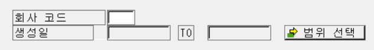
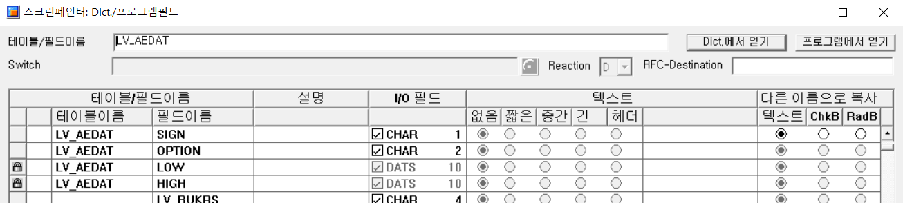
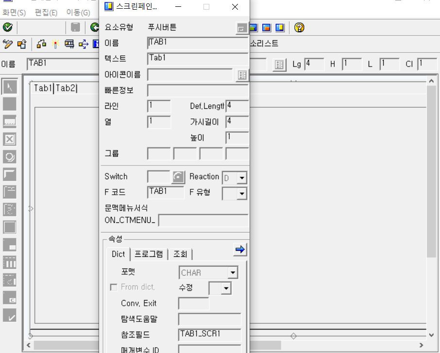
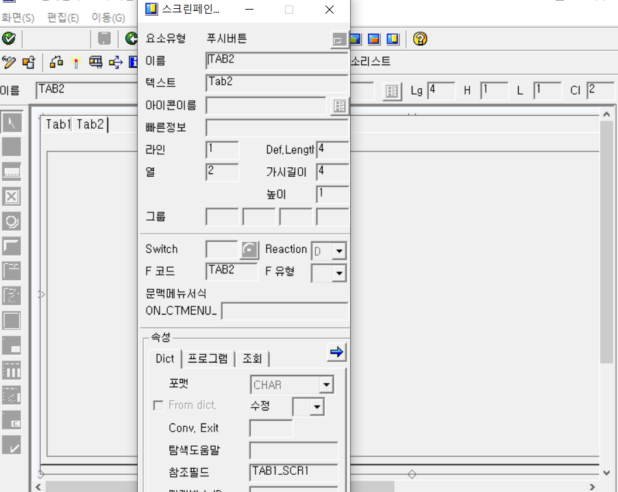
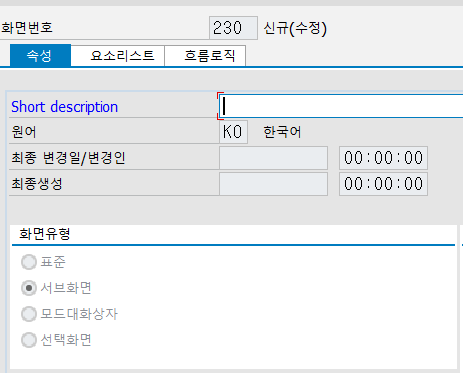

# 11. MODULE POOL

모듈풀 이란 module이 있는 pool로, 하나의 공간에 로직을 묶어두는 개념이다. 그래서 일반 레포트 프로그램과는 달리 trigger가 없으면 실행이 되지 않는다.

모듈풀의 네이밍 룰은 SAPMZ... 이다.

## 1. 스크린을 생성하지 않은 화면 구성법
1-1. 데이터 선언

1-2. INITIALIZATION

 화면 실행 전에 미리 한번만 띄워 놓는 부분인것 같다.

```abap
INITIALIZATION.
  S_ZSDATE-HIGH = SY-DATUM. "첫번째 조건. 오늘날짜 값
  APPEND S_ZSDATE.
```

SELECT OPTIONS 등에 미리 값을 넣어둔다던지,

```abap
INITIALIZATION.
  TOP-OF-PAGE.
  WRITE : /20(20) SY-ULINE.
  WRITE : /20(1) SY-VLINE NO-GAP.
  WRITE : 21(18) '부양 가족 수' NO-GAP CENTERED.
  WRITE : 39(1) SY-VLINE NO-GAP.
  WRITE : /20(20) SY-ULINE.
```
화면을 띄울 때 필드명을 띄우는것 처럼 미리 지정을 해둔다던지 하는 방식인것같다.

1-3. AT SELECTION SCREEN OUTPUT

SELECTION SCREEN으로 지정된 값들이 특정 행위를 통해 변하는? 것을 나타내는 부분인것 같다.

```abap
AT SELECTION-SCREEN OUTPUT.
  "LOOP AT SCREEN. -> MODIFY SCREEN
  "3. CHECKBOX 체크시 사원면, 성별 SELECT-OPTIONS 필드가 비활성화
  LOOP AT SCREEN.
    IF P_CHK = 'X'. "USER-COMMAND를 설정 해주었기때문에 먹힘
      IF SCREEN-GROUP1 = 'ID1'.
        SCREEN-INPUT = 0. "해당 그룹 필드들 비활성화
      ELSE.
        SCREEN-INTENSIFIED = 1.
      ENDIF.
    ENDIF.
    MODIFY SCREEN.
  ENDLOOP.
```
1-4. START-OF-SELECTION

SELECTION SCREEN부분 등등에서 값을 할당하고 화면에 띄워주는 부분을 어떻게 띄워 줄 것인이 SELECT해서 값을 넣는 부분. 
```abap
START-OF-SELECTION.
SELECT *
  INTO CORRESPONDING FIELDS OF TABLE GT_ZSUWONT02
  FROM ZDSUWONT02
  WHERE ZSDATE IN S_ZSDATE
  AND ZEMPNO IN S_ZSDATE
  AND ZEMPNM IN S_ZEMPNM
  AND ZDEPT IN S_ZDEPT
  AND ZGENDER IN S_ZGEN.
```
```abap
SET PF-STATUS 'STATUS1000'.
```
이 부분에 스테이터스 값으로 버튼을 구성하여 화면이 뜬 후 버튼을 넣어 둘 수 있다. 이 버튼은 END-OF-SELECTION에서 실행을 설정 할 수 있다.

1-5. END-OF-SELECTION

보통은 안적어줘도 SELECT 한 후 끝에 WRITE등등으로 뿌려주기만 하면 뜨긴 하는 부분이다.

```abap
AT USER-COMMAND.
  CASE SY-UCOMM.
    WHEN 'LEAV'.
      LEAVE PROGRAM.
    WHEN 'BACK'.
      LEAVE TO SCREEN 0.
  ENDCASE.
```
이 부분에 USER-COMMAND를 이용하여 화면이 뜬 후 생성할 버튼의 기능을 설정 할 수 있다.

## 2. 모듈풀 화면 구성
## PBO, PAI


```abap
PROCESS BEFORE OUTPUT.
  MODULE STATUS_0100.
PROCESS AFTER INPUT.
  MODULE USER_COMMAND_0100.
```
간단히 생각하면 스크린(여기서는 100번)을 띄우기 전은 PBO, 스크린 띄운 후는 PAI인듯 한데 실습을 심화하다보면 약간 헷갈릴 때가 있다. 일단 그렇게 생각하고 학습을 진행하는게 좋을것같다.

실행

모듈풀은 스크린을 띄우려면 꼭 트랜잭션코드를 생성해서 띄워야 한다.

그렇게 하지 않았더니 그냥 실행하면 화면이 뜨지 않는다.

2-1. PBO
```abap
*&---------------------------------------------------------------------*
*& Module STATUS_0100 OUTPUT
*&---------------------------------------------------------------------*
*&
*&---------------------------------------------------------------------*
MODULE status_0100 OUTPUT.
 SET PF-STATUS 'STATUS100'.
 SET TITLEBAR 'T100'.
ENDMODULE.
```
기본적으로는 스크린 띄우기 전 버튼과 제목을 생성한다.

2-2. PAI

```abap
*&---------------------------------------------------------------------*
*&      Module  USER_COMMAND_0100  INPUT
*&---------------------------------------------------------------------*
*       text
*----------------------------------------------------------------------*
MODULE user_command_0100 INPUT.
  CASE OK_CODE.
    WHEN 'BACK'.
      LEAVE TO SCREEN 0.
  	WHEN 'EXIT'.
      LEAVE PROGRAM.
  ENDCASE.
ENDMODULE.
```
기본적으로는 스크린을 띄운 후 버튼의 기능을 구성함.

```abap
MODULE user_command_0100 INPUT.
  CASE OK_CODE.
    WHEN 'BACK'.
      LEAVE TO SCREEN 0.
    WHEN 'DISP'.

      SELECT SINGLE ZEMPNM ZDEPT ZSDATE
        INTO ( ZDSUWONT02-ZEMPNM, ZDSUWONT02-ZDEPT, ZDSUWONT02-ZSDATE )
        FROM ZDSUWONT02
        WHERE ZEMPNO = ZDSUWONT02-ZEMPNO.

*  	WHEN OTHERS.
  ENDCASE.
  CLEAR OK_CODE.
ENDMODULE.
```
스크린 띄운 후 버튼을 누를 경우 정보가 뜨는 행위를 이와같이 SELECT하여 나타 낼 수 있다.

# TAB STRIP

탭 스트립이란 탭 별로 다른 컨텐츠를 보여주기 위한 도구의 개념이다.

## TAB STRIP 예시

### MAIN PROGRAM

우선 TOP INCLUE를 함께하여 모듈풀을 생성한다. 그렇게 되면 TOP INCLUDE 안에 프로그램이 선언되는 형태로 생성 된다.

```abap
*&---------------------------------------------------------------------*
*& 모듈풀               SAPMZ2302_01
*&
*&---------------------------------------------------------------------*
*&
*&
*&---------------------------------------------------------------------*
 INCLUDE MZ2302_01TOP                            .    " global Data
 INCLUDE MZ2302_01O01                            .  " PBO-Modules
 INCLUDE MZ2302_01I01                            .  " PAI-Modules
 INCLUDE MZ2302_01F01                            .  " FORM-Routines
```

그리고 데이터를 검색 할 100번 화면을 생성한다.

## 100번 스크린



레이아웃에 검색 할 칸들을 설정한다. 이때 SELECT OPTIONS와 같은 기능을 가지는 INPUT칸을 만들기 위해서는 다음에서 보이는 프로그램에서 얻기를 클릭하여 RANGES로 선언 해 준 변수를 찾아준다.



```abap
*&---------------------------------------------------------------------*
*&  Include           MZ2302_01I01
*&---------------------------------------------------------------------*
*&---------------------------------------------------------------------*
*&      Module  USER_COMMAND_0100  INPUT
*&---------------------------------------------------------------------*
*       text
*----------------------------------------------------------------------*
MODULE USER_COMMAND_0100 INPUT.

  GV_TAB-TABLENAME = 'EKKO'.
  GV_TAB-FIELDNAME = 'AEDAT'.

  CASE OK_CODE.
    WHEN 'BTS'.

      CALL FUNCTION 'COMPLEX_SELECTIONS_DIALOG'
        EXPORTING
          TITLE             = 'RANGE 버튼'
          TAB_AND_FIELD     = GV_TAB
        TABLES
          RANGE             = LV_AEDAT
        EXCEPTIONS
          NO_RANGE_TAB      = 1
          CANCELLED         = 2
          INTERNAL_ERROR    = 3
          INVALID_FIELDNAME = 4
          OTHERS            = 5.
      IF SY-SUBRC <> 0.
* MESSAGE ID SY-MSGID TYPE SY-MSGTY NUMBER SY-MSGNO
*         WITH SY-MSGV1 SY-MSGV2 SY-MSGV3 SY-MSGV4.
      ENDIF.

    WHEN 'GO'.
      PERFORM SELECT_DATA.
      CALL SCREEN 200.
    WHEN 'BACK' OR 'CANC'.
      LEAVE TO SCREEN 0.
    WHEN 'EXIT'.
      LEAVE PROGRAM.
    WHEN OTHERS.
  ENDCASE.
ENDMODULE.                 " USER_COMMAND_0100  INPUT
```

USER-COMMAND에는 이와같이 SELECT OPTIONS 옆의 버튼이 검색 창을 띄울 수 있도록 COMPLEX_SELECTIONS_DIALOG FUNCTION을 사용 해 준다.

실행버튼은 'GO' 버튼은, 이 버튼을 클릭하면 데이터를 SELECT 하여 200번 스크린을 호출 하도록 한다.

## 200번 스크린



TAB1, TAB2 탭을 만들고, 각 탭 안에 SUB SCREEN TAB1_SCR1을 넣어준다. 이 서브 스크린은 한개만 만들어서 두 탭에 모두 적용시켜 준다.



```abap
PROCESS BEFORE OUTPUT.
 MODULE STATUS_0200.
 MODULE SET_INIT.
 MODULE ALV_DISPLAY.

 CALL SUBSCREEN TAB1_SCR1 INCLUDING SY-REPID GV_DYNNR.

PROCESS AFTER INPUT.
 CALL SUBSCREEN TAB1_SCR1.
 MODULE USER_COMMAND_0200.
```

우선 SUBSCREEN을 PBO에서 현재 프로그램과 스크린을 지정해주어 불러오고, PAI에서도 불러준다.

여기서 GV_DYNNR은 서브스크린으로 쓸 스크린을 만들고 200 스크린의 PBO에 지정해 주면 된다. 이때 서브 스크린은 서브화면으로 생성해야 한다. OK CODE는 생성하지 않는다.




```abap
*&---------------------------------------------------------------------*
*&      Module  SET_INIT  OUTPUT
*&---------------------------------------------------------------------*
*       text
*----------------------------------------------------------------------*
MODULE SET_INIT OUTPUT.
  IF GV_CHECK IS INITIAL.
    TABSTRIP-ACTIVETAB = 'TAB1'.
    GV_DYNNR = '0210'.
    GV_CHECK = 'X'.
  ENDIF.
ENDMODULE.                 " SET_INIT  OUTPUT
```

TAB1이든 TAB2든 클릭하면 다시 스크린 200의 PBO를 타기때문에 GV_CHECK를 해주어 한번 TAB1의 스크린을 띄웠으면 다시 타지 않도록 한다.


그리고 서브 스크린 210의 PBO에 서브스크린에 띄울 ALV를 뿌려준다.
