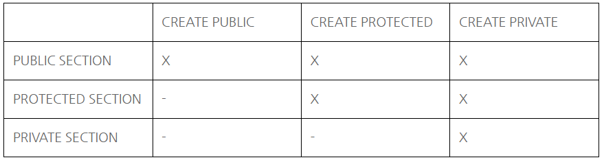
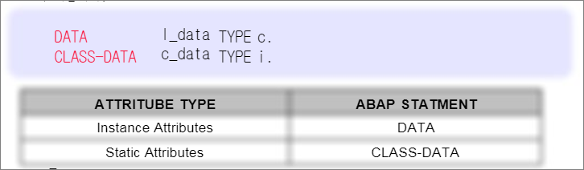
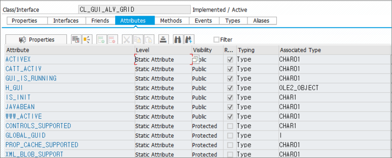
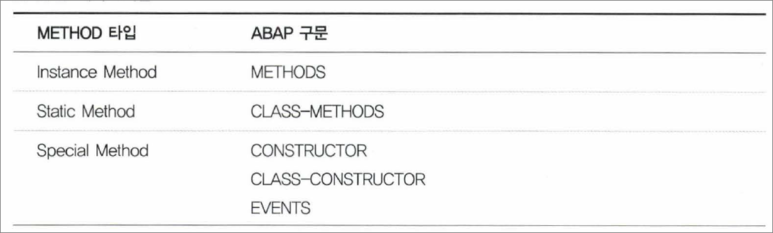

# 12. CLASS 학습

### Global Class
T-CODE : SE24에서 생성/조회/수정이 가능한 클래스

### Local Class 
SAP ABAP Program 내에서 선언하여 사용하는 클래스

### 선언

```abap
CLASS <클래스명> DEFINITION
// PUBLIC SECTION, PRIVATE SECTION, PROTECTED SECTION...

ENDCLASS.

CLASS <클래스명> IMPLEMENTATION.

...
ENDCLASS.
```
### OBJECT REFERENCE 선언


```abap
DATA LO_CLASS TYPE REF TO <CLASS명>.
```

-> 객체 참조 변수는 이미 존재하는 객체를 참고하거나 초기화 할 수 있으며 객체를 가리키는 참조변수가 객체의 실체를 알고 있으며 클래스의 인스턴스는 객체를 가르키는 참조 변수를 사용하여 주소를 지정.
객체 참조 변수를 이용하는 개체들은 객체의 구성요소에 직접접근은 불가하므로, REFERENCE(객체의 주소)를 이용해야 함.

### INSTANCE
하나의 클래스로부터 객체화 선언한 형태를 인스턴스라고함.

### 컴포넌트 (COMPONENT)
ATTRIBUTE, METHOD, EVENT, INTERFACE, CONSTRUCTOR 등의 구성요소


### 접근 제한영역(VISIBILITY SECTION)
CLASS의 접근 제한영역은 크게 3가지로 구분 됨.



### PUBLIC SECTION
- 하나의 클래스내에 선언된 컴포넌트들은 모든 클래스에서 상속 받아 사용 할 수 있는 영역
- 클래스와 사용자 간의 인터페이스 역할

### PROTECTED SECTION
- 자신과 상속받은 클래스에서만 컴포넌트드으 접근 할 수 있는 영역으로 자식과의 인터페이스 역할

### PRIVATED SECTION
- PRIVATED 선언 컴포넌트들은 같은 클래스에서만 메서드을 사용 할 수 있는 영역으로 외부에서 접근 할 수 없음
- 완전히 클래스에서 캡슐화 되어 타 클래스에서 사용 불가.

### ATTRIBUTE
CLASS 내에서 선언된 DATA FIELD로, TYPE C, I, F, N를 가질 수 있음(CLASS 내에 선언) 또한 REFERENCE VARIABLE 또한 정의가 가능하며, 클래스 내에서 객체를 참조하는 형태.

2가지 유형으로 구분.



1. INSTANCE ATTRIBUTE
-> INSTANCE-SPECIFIC 객체의 상태로 클래스 내에서 DATA구문을 사용하여 인스턴스 선언
DATA LC_DATA TYPE C

2. STATIC ATTRIBUTE
-> STATIC 속성은 모든 인스턴스에 유용한 클래스의 상태를 정의, 인스턴스 수에 상관없이 클래스에 의존적이며 클래스만의 고요휴나 영역으로 클래스 실행환경에서 접근 가능.
CLASS-DATA C_DATA TYPE I.

### GLOBAL STATIC ATTRIBUTE


### LOCAL STATIC ATTRIBUTE

특징
선언시, CLASS-DATA로 선언한다는 점.
접근시 =>로 STATIC ATTRIBUTE를 접근한다는 점.

### METHOD
하나의 클래스내에 기능 또는 절차를 말하며, 구체적인 행동과 유사한 이벤트라고 할 수 있음.
당연히, METHOD 내에서는 CLASS 내부의 ATTRIBUTE를 모두 접근 할 수 있음.

### 선언방법

```abap
METHOD <메소드명>.

ENDMETHOD
```

메소드의 세 가지 종류



INSTANCE METHOD
- 클래스의 모든 속성에 접근 할 수 있고, 클래스의 모든 이벤트에서 메서드 호출 가능.

STATIC METHOD
- CLASS-METHODS를 사용하여 STATIC 메서드을 선언하여 STATIC으로 선언된 STATIC 속성, STATIC 이벤트를 호출 할 수 있음.

### class에서 불러올때 작대기 규칙
-> 클래스의 특정 메소드를 불러올 때

=> 클래스의 특정 요소를 불러올 때

### 문법

```abap
CLASS MATH DEFINITION.
  PUBLIC SECTION.
    METHODS DIVIDE_1_BY
      IMPORTING OPERAND TYPE I
      RETURNING VALUE (RESULT) TYPE DECFLOAT34
      RASING CX_SY_ARITHMETIC_ERROR.
ENDCLASS.

CLASS MATH IMPLEMENTATION.
  METHOD DIVIDE_1_BY.
    RESULT = 1 / OPERAND.
  ENDMETHOD.
ENDCLASS.

DATA OREF TYPE REF TO MATH.
DATA EXC TYPE REF TO CX_SY_ARITHMETIC_ERROR.
DATA RES TYPE DECFLOAT34.
DATA TEXT TYPE STRING.

START-OF-SELECTION.
  CREATE OBJECT OREF.
  
  TRY.
    RES = OREF->DIVIDE_1_BY( 4 ).
    TEXT = RES.
  CATCH CX_SY_ARITHMETIC_ERROR INTO EXC.
    TEXT = EXC->GET_TEXT( ).
  ENDTRY.
  MESSAGE TEXT TYPE 'I'.
```

### 특징
IMPORTING PARAMETER로 숫자 '4'를 받아 DIVID_1_BY메서드에서 연산 후, RESULT변수로 RETURNING VALUE해주는 형태로 RES 변수에 값을 저장해주고, TEXT로 결과를 출력 함.
IMPORTING, RETURNING PARAMETERS의 특징을 알 수 있음.

## 1. 사용예제1
```abap
REPORT ZRSUWON02_1019_2.

CLASS C1 DEFINITION. "정의부
  PUBLIC SECTION. "누구나 사용 할 수 있는 CLASS.
  "PROTECTED는 부모와 자식 사이에서만 사용 가능
  "PRIVATE는 같은 클래스 안에서만 사용 가능
  METHODS M1.
ENDCLASS.

CLASS C1 IMPLEMENTATION. "실행부
  METHOD M1.
    WRITE : / 'CLASS TEST'.
  ENDMETHOD.
ENDCLASS.

DATA : GO_1 TYPE REF TO C1. "객체 참조 변수

START-OF-SELECTION.

CREATE OBJECT GO_1. "객체 생성
CALL METHOD GO_1->M1. "메소드 호출
```
정의부에서 사용할 메소드와 사용범위를 지정해준 후

실행부에서 메소드를 설정 해 준다. 나중에 이 메소드를 호출하면 WRITE분이 실행된다.

클래스는 객체를 이용하기위한 기능 이므로 객체로 사용할 변수를 지정해주고 OBJECT로 객체 생성 한 후

이 객체를 이용해 메소드를 호출하면 된다.

이때 START-OF-SELECTION은 데이터 선언와 구분짓기 위한 것으로, 구분 지을 수 있는 부분이면 어떤것이든 상관없는 듯 하다.

## 사용 예제 2
### ALV에서 DOUBLE CLICK 예제

```abap
CLASS EVENT DEFINITION.
  PUBLIC SECTION.

  METHODS HANDLE_DOUBLE_CLICK FOR EVENT DOUBLE_CLICK
                              OF CL_GUI_ALV_GRID
                              IMPORTING E_ROW
                                        E_COLUMN
                                        ES_ROW_NO.


ENDCLASS.

CLASS EVENT IMPLEMENTATION.
  METHOD HANDLE_DOUBLE_CLICK.
    PERFORM ALV_HANDLE_DOUBLE_CLICK USING E_ROW
                                          E_COLUMN
                                          ES_ROW_NO.
  ENDMETHOD.
ENDCLASS.
```

```abap
FORM alv_handle_double_click  USING    e_row TYPE LVC_S_ROW
                                       e_column TYPE LVC_S_COL
                                       es_row_no TYPE LVC_S_ROID.

  "한 셀을 선택하면 뜨도록 함.
*  CASE e_column-FIELDNAME.
*    WHEN 'ITEM_CODE'.
**      CLEAR GS_DATA.
*      READ TABLE GT_DATA INTO GS_DATA INDEX ES_ROW_NO-ROW_ID.
*          SELECT * FROM ZTJ_STOCK INTO CORRESPONDING FIELDS OF TABLE GT_DATA2 WHERE ITEM_CODE = GS_DATA-ITEM_CODE.
*            PERFORM REFRESH.
*
*      MESSAGE 'HI' TYPE 'S'.
*   ENDCASE.

  "한 줄 선택 하면 뜨도록 함
  CLEAR GS_DATA.
  READ TABLE GT_DATA INTO GS_DATA INDEX ES_ROW_NO-ROW_ID.
  SELECT * FROM ZTJ_STOCK INTO CORRESPONDING FIELDS OF TABLE GT_DATA2 WHERE ITEM_CODE = GS_DATA-ITEM_CODE.
    PERFORM REFRESH.

ENDFORM.
```

CL_GUI_ALV_GRID 클래스에서 DOUBLECLICK EVENTS를 참조하여 METHOD를 만들고 이를 이용.

## 사용예제 3 
### TOP OF PAGE 사용 예제

DEFINITION

```abap
class lcl_event_receiver definition.

  public section.
    methods:
      handle_top_of_page for event top_of_page of cl_gui_alv_grid
        importing e_dyndoc_id table_index.
  private section.

endclass. "LCL_EVENT_RECEIVER DEFINITION
```

IMPLEMENTATION

```abap
  method handle_top_of_page.
    perform event_top_of_page using e_dyndoc_id
                                    table_index.
  endmethod.

endclass. "LCL_EVENT_RECEIVER IMPLEMENTATION
```

띄워 줄 내용을 설정.

```abap
&---------------------------------------------------------------------*
*&      Form  EVENT_TOP_OF_PAGE
*&---------------------------------------------------------------------*
*       text
*----------------------------------------------------------------------*
*      -->P_E_DYNDOC_ID  text
*      -->P_TABLE_INDEX  text
*----------------------------------------------------------------------*
FORM EVENT_TOP_OF_PAGE  USING P_DYNDOC_ID  TYPE REF TO CL_DD_DOCUMENT
                              P_TABLE_INDEX TYPE SYINDEX.
  DATA : LV_TEXT TYPE CHAR255.
  DATA : LV_TEXT2 TYPE CHAR255.
  DATA : LV_TEXT3 TYPE CHAR255.
  DATA : LV_TEXT4 TYPE CHAR255.
  DATA : LV_TEXT5 TYPE CHAR255.

  CALL METHOD P_DYNDOC_ID->INITIALIZE_DOCUMENT( ).

  CLEAR : LV_TEXT, LV_TEXT2, LV_TEXT3, LV_TEXT4, LV_TEXT5.
  CONDENSE LV_TEXT NO-GAPS.

  CONCATENATE '회사 코드 : ' P_BUKRS INTO LV_TEXT SEPARATED BY SPACE.
  IF S_AEDAT IS NOT INITIAL.
    CASE S_AEDAT-OPTION.
      WHEN 'EQ'.
        CONCATENATE '레코드 생성일 : '  S_AEDAT-LOW+0(4) '년' S_AEDAT-LOW+4(2) '월'
                                        S_AEDAT-LOW+6(2) '일' INTO LV_TEXT2.
      WHEN 'BT'.
        IF S_AEDAT-LOW IS NOT INITIAL.
          CONCATENATE '레코드 생성일 : ' S_AEDAT-LOW+0(4) '년' S_AEDAT-LOW+4(2) '월'
                                        S_AEDAT-LOW+6(2) '일' ' ~ '
                                        S_AEDAT-HIGH+0(4) '년' S_AEDAT-HIGH+4(2) '월'
                                        S_AEDAT-HIGH+6(2) '일' INTO LV_TEXT2.
        ELSE.
          CONCATENATE '레코드 생성일 : ' ' ~ '
                      S_AEDAT-HIGH+0(4) '년' S_AEDAT-HIGH+4(2) '월'
                      S_AEDAT-HIGH+6(2) '일' INTO LV_TEXT2.
        ENDIF.

      WHEN OTHERS.
    ENDCASE.
  ELSE.
    LV_TEXT2 = '레코드 생성일 : -'.
  ENDIF.
  IF S_WERKS IS NOT INITIAL.

    CASE S_WERKS-OPTION.
      WHEN 'EQ'.
        CONCATENATE '플랜트 : '  S_WERKS-LOW INTO LV_TEXT3.
      WHEN 'BT'.
        IF S_WERKS-LOW IS NOT INITIAL.
          CONCATENATE '플랜트 : ' S_WERKS-LOW ' ~ '
                                S_WERKS-HIGH INTO LV_TEXT3.
        ELSE.
          CONCATENATE '플랜트 : ' ' ~ '
                      S_WERKS-HIGH INTO LV_TEXT3.
        ENDIF.

      WHEN OTHERS.
    ENDCASE.
  ELSE.
    LV_TEXT3 = '플랜트 : -'.
  ENDIF.
  IF S_LGORT IS NOT INITIAL.

    CASE S_LGORT-OPTION.
      WHEN 'EQ'.
        CONCATENATE '저장 위치 : '  S_LGORT-LOW INTO LV_TEXT4.
      WHEN 'BT'.
        IF S_LGORT-LOW IS NOT INITIAL.
          CONCATENATE '저장 위치 : ' S_LGORT-LOW ' ~ '
                                S_LGORT-HIGH INTO LV_TEXT4.
        ELSE.
          CONCATENATE '저장 위치 : ' ' ~ '
                      S_LGORT-HIGH INTO LV_TEXT4.
        ENDIF.

      WHEN OTHERS.

    ENDCASE.

  ELSE.
    LV_TEXT4 = '저장 위치 : -'.
  ENDIF.
  IF S_MATNR IS NOT INITIAL.

    CASE S_MATNR-OPTION.
      WHEN 'EQ'.
        CONCATENATE '자재 : '  S_MATNR-LOW INTO LV_TEXT5.
      WHEN 'BT'.
        IF S_MATNR-LOW IS NOT INITIAL.
          CONCATENATE '자재 : ' S_MATNR-LOW ' ~ '
                                S_MATNR-HIGH INTO LV_TEXT5.
        ELSE.
          CONCATENATE '자재 : ' ' ~ '
                      S_MATNR-HIGH INTO LV_TEXT5.
        ENDIF.

      WHEN OTHERS.

    ENDCASE.
  ELSE.
    LV_TEXT5 = '자재 : -'.
  ENDIF.

  "문구 추가
  CALL METHOD P_DYNDOC_ID->ADD_TEXT
    EXPORTING
      TEXT          = LV_TEXT
      SAP_FONTSTYLE = P_DYNDOC_ID->LARGE    " 폰트 사이즈 좁게
      SAP_EMPHASIS  = P_DYNDOC_ID->STRONG.  " 굵게

  "현재 커서라인에서 줄바꿈
  CALL METHOD P_DYNDOC_ID->NEW_LINE.

  CALL METHOD P_DYNDOC_ID->ADD_TEXT
    EXPORTING
      TEXT          = LV_TEXT2
      SAP_FONTSTYLE = P_DYNDOC_ID->LARGE    " 폰트 사이즈 좁게
      SAP_EMPHASIS  = P_DYNDOC_ID->STRONG.  " 굵게

  CALL METHOD P_DYNDOC_ID->NEW_LINE.

  CALL METHOD P_DYNDOC_ID->ADD_TEXT
    EXPORTING
      TEXT          = LV_TEXT3
      SAP_FONTSTYLE = P_DYNDOC_ID->LARGE    " 폰트 사이즈 좁게
      SAP_EMPHASIS  = P_DYNDOC_ID->STRONG.  " 굵게

  CALL METHOD P_DYNDOC_ID->NEW_LINE.

  CALL METHOD P_DYNDOC_ID->ADD_TEXT
    EXPORTING
      TEXT          = LV_TEXT4
      SAP_FONTSTYLE = P_DYNDOC_ID->LARGE    " 폰트 사이즈 좁게
      SAP_EMPHASIS  = P_DYNDOC_ID->STRONG.  " 굵게

  CALL METHOD P_DYNDOC_ID->NEW_LINE.

  CALL METHOD P_DYNDOC_ID->ADD_TEXT
    EXPORTING
      TEXT          = LV_TEXT5
      SAP_FONTSTYLE = P_DYNDOC_ID->LARGE    " 폰트 사이즈 좁게
      SAP_EMPHASIS  = P_DYNDOC_ID->STRONG.  " 굵게

*-- 출력
  CALL METHOD P_DYNDOC_ID->DISPLAY_DOCUMENT
    EXPORTING
      PARENT        = GR_HEAD_CONTAINER "1번쨰 컨테이너와 연결
      REUSE_CONTROL = 'X'.   " TOP페이지 화면 값이 액션에 따라 변경
ENDFORM.                    " EVENT_TOP_OF_PAGE
```

그리고 HANDLE과 CALL METHOD를 선언해 준다.

```abap
DATA : GV_DOCUMENT TYPE REF TO CL_DD_DOCUMENT.
CREATE OBJECT GV_DOCUMENT.
SET HANDLER GO_EVENT_RECEIVER->HANDLE_TOP_OF_PAGE FOR GR_GRID1.

CALL METHOD GR_GRID1->LIST_PROCESSING_EVENTS
  EXPORTING
    I_EVENT_NAME = 'TOP_OF_PAGE'
    I_DYNDOC_ID  = GV_DOCUMENT.
```
