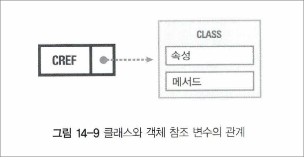
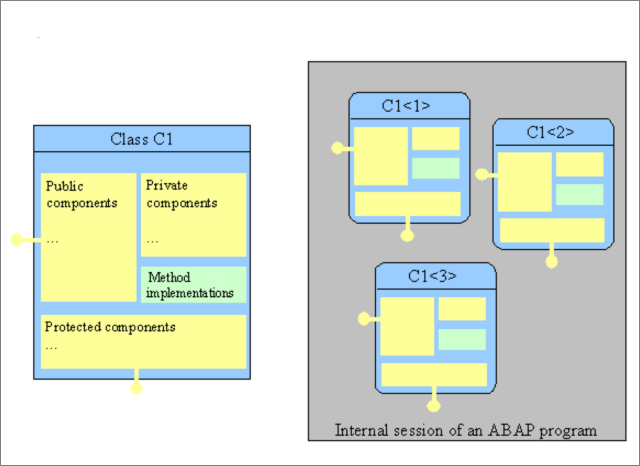

# 12. CLASS 학습

### Global Class
T-CODE : SE24에서 생성/조회/수정이 가능한 클래스

### Local Class 
SAP ABAP Program 내에서 선언하여 사용하는 클래스

### 선언

```abap
CLASS <클래스명> DEFINITION
// PUBLIC SECTION, PRIVATE SECTION, PROTECTED SECTION...

ENDCLASS.

CLASS <클래스명> IMPLEMENTATION.

...
ENDCLASS.
```
### OBJECT REFERENCE 선언



```abap
DATA LO_CLASS TYPE REF TO <CLASS명>.
```

-> 객체 참조 변수는 이미 존재하는 객체를 참고하거나 초기화 할 수 있으며 객체를 가리키는 참조변수가 객체의 실체를 알고 있으며 클래스의 인스턴스는 객체를 가르키는 참조 변수를 사용하여 주소를 지정.
객체 참조 변수를 이용하는 개체들은 객체의 구성요소에 직접접근은 불가하므로, REFERENCE(객체의 주소)를 이용해야 함.

### INSTANCE
하나의 클래스로부터 객체화 선언한 형태를 인스턴스라고함.

### 컴포넌트 (COMPONENT)
ATTRIBUTE, METHOD, EVENT, INTERFACE, CONSTRUCTOR 등의 구성요소



### 접근 제한영역(VISIBILITY SECTION)
CLASS의 접근 제한영역은 크게 3가지로 구분 됨.

## 1. 사용예제1
```abap
REPORT ZRSUWON02_1019_2.

CLASS C1 DEFINITION. "정의부
  PUBLIC SECTION. "누구나 사용 할 수 있는 CLASS.
  "PROTECTED는 부모와 자식 사이에서만 사용 가능
  "PRIVATE는 같은 클래스 안에서만 사용 가능
  METHODS M1.
ENDCLASS.

CLASS C1 IMPLEMENTATION. "실행부
  METHOD M1.
    WRITE : / 'CLASS TEST'.
  ENDMETHOD.
ENDCLASS.

DATA : GO_1 TYPE REF TO C1. "객체 참조 변수

START-OF-SELECTION.

CREATE OBJECT GO_1. "객체 생성
CALL METHOD GO_1->M1. "메소드 호출
```
정의부에서 사용할 메소드와 사용범위를 지정해준 후

실행부에서 메소드를 설정 해 준다. 나중에 이 메소드를 호출하면 WRITE분이 실행된다.

클래스는 객체를 이용하기위한 기능 이므로 객체로 사용할 변수를 지정해주고 OBJECT로 객체 생성 한 후

이 객체를 이용해 메소드를 호출하면 된다.

이때 START-OF-SELECTION은 데이터 선언와 구분짓기 위한 것으로, 구분 지을 수 있는 부분이면 어떤것이든 상관없는 듯 하다.

## 사용 예제 2
1. ALV에서 DOUBLE CLICK 예제

```abap
CLASS EVENT DEFINITION.
  PUBLIC SECTION.

  METHODS HANDLE_DOUBLE_CLICK FOR EVENT DOUBLE_CLICK
                              OF CL_GUI_ALV_GRID
                              IMPORTING E_ROW
                                        E_COLUMN
                                        ES_ROW_NO.


ENDCLASS.

CLASS EVENT IMPLEMENTATION.
  METHOD HANDLE_DOUBLE_CLICK.
    PERFORM ALV_HANDLE_DOUBLE_CLICK USING E_ROW
                                          E_COLUMN
                                          ES_ROW_NO.
  ENDMETHOD.
ENDCLASS.
```

```abap
FORM alv_handle_double_click  USING    e_row TYPE LVC_S_ROW
                                       e_column TYPE LVC_S_COL
                                       es_row_no TYPE LVC_S_ROID.

  "한 셀을 선택하면 뜨도록 함.
*  CASE e_column-FIELDNAME.
*    WHEN 'ITEM_CODE'.
**      CLEAR GS_DATA.
*      READ TABLE GT_DATA INTO GS_DATA INDEX ES_ROW_NO-ROW_ID.
*          SELECT * FROM ZTJ_STOCK INTO CORRESPONDING FIELDS OF TABLE GT_DATA2 WHERE ITEM_CODE = GS_DATA-ITEM_CODE.
*            PERFORM REFRESH.
*
*      MESSAGE 'HI' TYPE 'S'.
*   ENDCASE.

  "한 줄 선택 하면 뜨도록 함
  CLEAR GS_DATA.
  READ TABLE GT_DATA INTO GS_DATA INDEX ES_ROW_NO-ROW_ID.
  SELECT * FROM ZTJ_STOCK INTO CORRESPONDING FIELDS OF TABLE GT_DATA2 WHERE ITEM_CODE = GS_DATA-ITEM_CODE.
    PERFORM REFRESH.

ENDFORM.
```

CL_GUI_ALV_GRID 클래스에서 DOUBLECLICK EVENTS를 참조하여 METHOD를 만들고 이를 이용.

