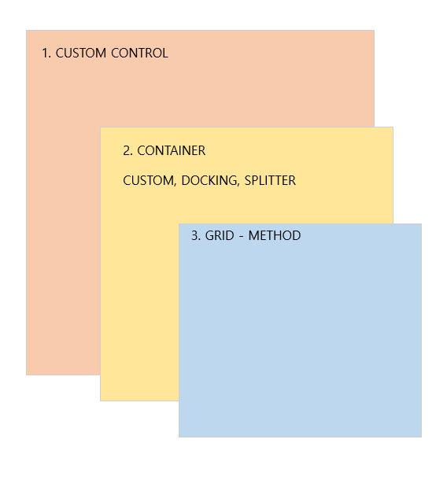
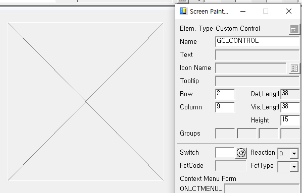
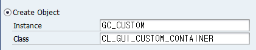
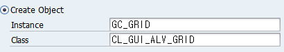
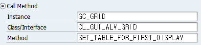
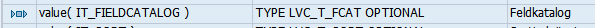
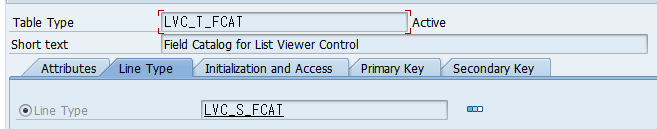
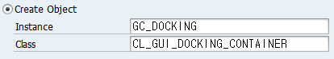
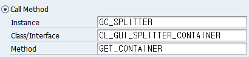

# ALV 학습


우선 ALV는 스크린을 띄울때 바로 화면에 나와야 하므로 스크린을 띄우기 전에 세팅이 되어있어야 하는 부분이다.

그러므로 PBO에 들어간다.

```abap
PROCESS BEFORE OUTPUT.
 MODULE STATUS_0100.
 MODULE DISPLAY_ALV.

PROCESS AFTER INPUT.
 MODULE USER_COMMAND_0100.
```
커스텀 화면을 구성한다.


# 1. CUSTOM ALV
GRID를 담을 CONTAINER 생성

```abap
CREATE OBJECT GC_CUSTOM
    exporting
*      parent                      =
      container_name              = 'GC_CONTROL'.
```
커스텀된 상자 안에 컨테이너를 생성하므로 CONTAINER_NAME에는 상자 이름을 적어준다.

CONTAINER가 아님 주의.

테이블메소드를 그릴 GRID 생성

```abap
CREATE OBJECT GC_GRID
    exporting
*      i_shellstyle      = 0
*      i_lifetime        =
      i_parent          = GC_CUSTOM.
```
GC_CUSTOM이라는 컨테이너 오브젝트에 담기므로 I_PARENT는 GC_CUSTOM이 된다.

여기서 오브젝트 변수들을 선언해주고 넘어가본다.
```abap
DATA : GC_CUSTOM TYPE REF TO CL_GUI_CUSTOM_CONTAINER.
DATA : GC_CUSTOM2 TYPE REF TO CL_GUI_CUSTOM_CONTAINER.
DATA : GC_GRID TYPE REF TO CL_GUI_ALV_GRID.
DATA : GC_GRID2 TYPE REF TO CL_GUI_ALV_GRID.
```
그리드에 그릴 표 메소드를 생성한다.

```abap
CALL METHOD gc_grid->set_table_for_first_display
*      ir_salv_adapter               =
    CHANGING
      it_outtab                     = GT_DATA
      it_fieldcatalog               = GT_FCAT
```
생성되는 테이블은 GT_DATA이고 테이블 위에 뜨는 필드 이름들은 GT_FCAT 이다.

이 메소드는 필드 카탈로그 타입이

으로 LVC_T_FCAT을 옵션으로 사용한다.


```abap
DATA : BEGIN OF gs_data,
        zcode TYPE ztsuwon02_hr-zcode,
        zname TYPE ztsuwon02_hr-zname,
       END OF gs_data,
       gt_data LIKE TABLE OF gs_data.

DATA : GT_FCAT TYPE LVC_T_FCAT,
       GS_FCAT TYPE LVC_S_FCAT.
```
그러므로 이것을 참조해서 변수를 선언 해 준다.

그리고 필드 네임들은 스크린이 뜨기 전에 구성되어있어야 하므로 PBO에 함께 지정해 준다.

```abap
GS_FCAT-FIELDNAME = 'ZCODE'.
GS_FCAT-COLTEXT = '코드'.
APPEND GS_FCAT TO GT_FCAT.

GS_FCAT-FIELDNAME = 'ZNAME'.
GS_FCAT-COLTEXT = '코드명'.
APPEND GS_FCAT TO GT_FCAT.
```
# 2. DOCKING ALV
DOCKING ALV는 스크린 화면에 맞추어 설정 가능하다.

DOCKING 컨테이너를 만들고 그리드를 생성 한 후 메소드를 넣으면 된다.

DOCKING CONTAINER 생성


```abap
CREATE OBJECT GC_DOCKING
  EXPORTING
*    parent                      =
    repid                       = SY-REPID
    dynnr                       = SY-DYNNR "화면번호 100번이 됨
    side                        = CL_GUI_DOCKING_CONTAINER=>DOCK_AT_BOTTOM "1,2,4,8.. , LEFT...
    extension                   = 300
```
여기서 도킹 클래스를 확인해 본다. 클래스는 SE24에서 확인 가능.
```abap
CREATE OBJECT GC_GRID
  exporting
*    i_shellstyle      = 0
*    i_lifetime        =
    i_parent          = GC_DOCKING.
```
GRID 생성 후 GRID METHOD 호출은 같은 방식.

# 3. SPLITTER ALV
```abap
DATA : GC_DOCKING TYPE REF TO CL_GUI_DOCKING_CONTAINER.
DATA : GC_SPLITTER TYPE REF TO CL_GUI_SPLITTER_CONTAINER.
DATA : GC_CONTAINER_1 TYPE REF TO CL_GUI_CONTAINER.
```
SPLITTER는 DOCKING한 공간에 ALV를 나누는 기능 이므로

DOCKING을 생성 후 그 안에 SPLITTER를 넣는다.

위의 ALV들과 다른 점은 나눈 SPLITTER들에 하나하나 위치 메소드를 지정 해 준 후 객체를 생성하여 집어넣어야한다.

DOCKING CONTAINER 생성 후 SPLITTER CONTAINER 생성
```abap
CREATE OBJECT GC_SPLITTER
    EXPORTING
      parent            = GC_DOCKING
      rows              = 1
      columns           = 2.
```
이후 나누어진 SPLITTER들 위치를 할당할 메소드를 불러 와서 할당.

```abap
CALL METHOD gc_splitter->get_container
  EXPORTING
    row       = 1
    column    = 1
  RECEIVING
    container = GC_CONTAINER_1
    .
CALL METHOD gc_splitter->get_container
  EXPORTING
    row       = 1
    column    = 2
  RECEIVING
    container = GC_CONTAINER_2
    .
```
(1,1) SPLITTER 자리를 GC_CONTAINER_1이라고 지정함. 이후 이 컨테이너에 그리드를 넣어 줌

```abap
CREATE OBJECT GC_GRID_1
  exporting
*    i_shellstyle      = 0
*    i_lifetime        =
    i_parent          = GC_CONTAINER_1.
```
이후 그리드 메소드를 할당 해 주면 됨.
