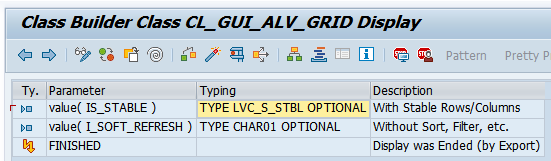
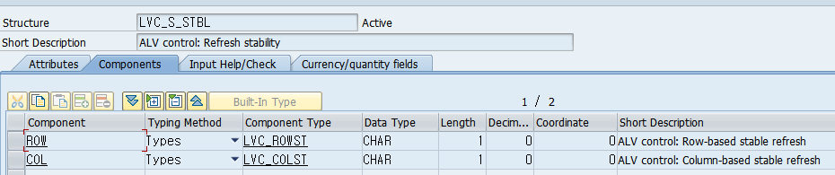

# ALV REFRESH에 대해

REFRESH_TABLE_DISPLAY는 이름이  REFRESH가 들어가서 표를 새로고침 하는 개념인것 같다.

예를 들면

```ABAP
WHEN 'APPEND'.
      READ TABLE GT_DATA INTO GS_DATA INDEX 1.
      APPEND GS_DATA TO GT_DATA.
```
APPEND라는 버튼을 누르면 인터널 테이블 첫번째 줄 값을 다시 인터널 테이블 맨 아랫쪽에 붙여넣는 PAI문을 넣었는데,

이렇게만 넣으면 인터널테이블에 값이 들어가기만 하고 ALV화면에는 뜨지 않는다.

그래서 ALV 화면을 다시 새로고침 해서 인터널 테이블 값을 띄워 주어야 한다.

PBO 에

```ABAP
CALL METHOD gc_grid_1->refresh_table_display
      EXPORTING
        is_stable      = LS_STABLE
*        i_soft_refresh =
*      EXCEPTIONS
*        finished       = 1
*        others         = 2
            .
    IF sy-subrc <> 0.
*     Implement suitable error handling here
    ENDIF.
```
CL_GUI_ALV_GRID 클래스의 REFRESH_TABLE_DISPLAY 메소드를 호출하여 새로고침을 하여
```ABAP
MODULE alv_display_0100 OUTPUT.

  IF GC_DOCKING IS INITIAL.
    PERFORM CREATE_OBJECT. "객체 생성
    PERFORM FIELD_CATALOG. "필드 카탈로그
    PERFORM ETC.           "VARIANT / TOOLBAR 등등
    PERFORM LAYOUT.        "레이아웃
    PERFORM DISPLAY_ALV.   "출력 메소드
  ELSE.
    PERFORM REFRESH.
  ENDIF.

ENDMODULE.
```
GC_DOCKING 컨테이너가 실행 되어 있을 시 새로고침 해주도록 하면 APPEND 버튼을 눌렀을 때 새로 추가된 줄이 나타나게 된다.



이때 그냥 REFRESH만 한다면 STABLE값을 지정 할 필요는 없는듯 하다. 그렇게되면 맨 아랫쪽에 계속 붙는다.
