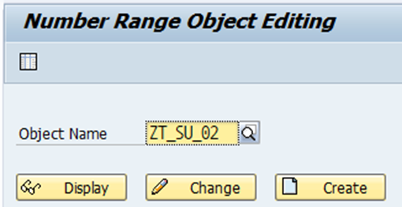
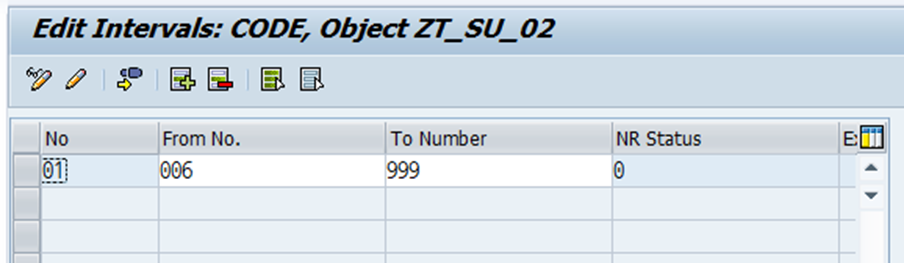
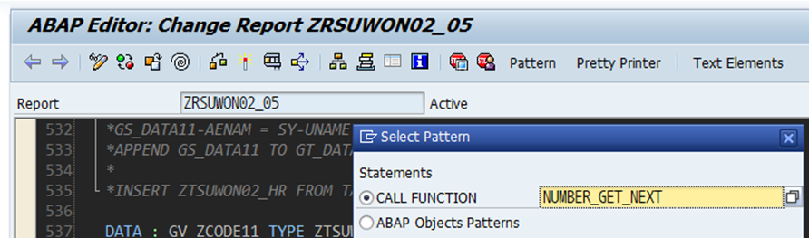

# 숫자를 자동으로 집어넣고 싶을 때 찾아보는 코드

SNRO에서 NUMBER RANGE를 생성한다.



그 후 INTERVALS EDIT을 함.



그 후 자동으로 붙여넣고자 할 때 NUMBER_GET_NEXT FUNCTION을 이용한다.



```abap
DATA : GV_SNRO(3).
DATA : GV_WO(5).

"SNRO INTERVAL 설정 후

CALL FUNCTION 'NUMBER_GET_NEXT'
  EXPORTING
    nr_range_nr                   = '01'
    object                        = 'ZTJ_02'
*   QUANTITY                      = '1'
*   SUBOBJECT                     = ' '
*   TOYEAR                        = '0000'
*   IGNORE_BUFFER                 = ' '
 IMPORTING
   NUMBER                        = GV_SNRO
*   QUANTITY                      =
*   RETURNCODE                    =
* EXCEPTIONS
*   INTERVAL_NOT_FOUND            = 1
*   NUMBER_RANGE_NOT_INTERN       = 2
*   OBJECT_NOT_FOUND              = 3
*   QUANTITY_IS_0                 = 4
*   QUANTITY_IS_NOT_1             = 5
*   INTERVAL_OVERFLOW             = 6
*   BUFFER_OVERFLOW               = 7
*   OTHERS                        = 8
          .
IF sy-subrc <> 0.
* Implement suitable error handling here
ENDIF.

CONCATENATE 'WO' GV_SNRO INTO GV_WO.

MESSAGE 'HELLO' TYPE 'S'.
```
