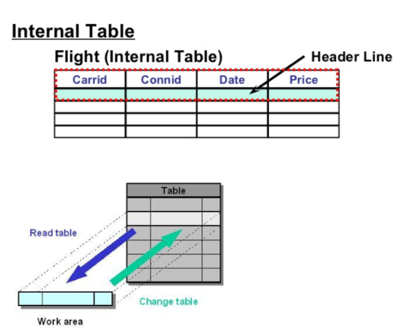

# 2. system 변수와 수 정리

인터널 테이블이 무엇인지 제대로 알려주지 않아서 검색해 보니,

DB의 데이터에 접근 및 조작할 때, local 메모리 영역에 담아두어 사용하는것이라고 한다. 매번 DB에 직접적으로 접근하지 않아도 되어 부하를 줄일 수 있다고 하는데, 정확히 무슨말인지는 모르겠다.

우선 사용하면서 이해한 것은, 테이블을 일단 만들어 두고 값을 넣어야 할 때 타입에 맞추어 넣을 수 있도록 하는것인 것 같다. 계속 사용하면서 이해하게 되면 글을 수정해야 할 것 같다.

```abap
"1. 구조체 타입 - 인터널 테이블 타입 - 인터널 테이블
TYPES : BEGIN OF TY_STR1,
          COL1 TYPE C LENGTH 10,
          COL2 TYPE C LENGTH 10,
          COL3 TYPE C LENGTH 10,
        END OF TY_STR1.
TYPES : TY_ITAB TYPE TABLE OF TY_STR1.

DATA : GT_DATA TYPE TY_ITAB.
DATA : GS_DATA TYPE TY_STR1.

"2. 구조체 타입 - 인터널 테이블
TYPES : BEGIN OF TY_STR2,
          COL1 TYPE C LENGTH 10,
          COL2 TYPE C LENGTH 10,
          COL3 TYPE C LENGTH 10,
        END OF TY_STR2.
DATA : GT_DATA2 TYPE TABLE OF TY_STR2.
DATA : GS_DATA2 TYPE TY_STR2.

"3. 구조체 타입 - 구조체 선언 - 인터널 테이블
TYPES : BEGIN OF TY_STR3,
          COL1 TYPE C LENGTH 10,
          COL2 TYPE C LENGTH 10,
          COL3 TYPE C LENGTH 10,
        END OF TY_STR3.
DATA : GS_DATA3 TYPE TY_STR3.
DATA : GT_DATA3 LIKE TABLE OF GS_DATA3.

"4. 구조체 선언 - 인터널 테이블 선언
DATA : BEGING OF GS_DATA4,
        COL1 TYPE C LENGTH 10,
        COL2 TYPE C LENGTH 10,
        COL3 TYPE C LENGTH 10,
      END OF GS_DATA4.
DATA : GT_DATA4 LIKE TABLE OF GS_DATA4.

"5. 인터널 테이블 선언
DATA : BEGIN OF GT_DATA5 OCCURS 0,
        COL1 TYPE C LENGTH 10,
        COL2 TYPE C LENGTH 10,
        COL3 TYPE C LENGTH 10,
      END OF GT_DATA6.
```

여기서 마지막에  occurs 0 도 그냥 적으래서 적었는데 뭔지 정확하게 안 알려주셨다. 그래서 검색함.

occurs는 시스템 실행 환경에서 인터널 테이블의 메모리 할당을 의미. 0으로 표시하면 메모리 제한을 두지 않는다는 뜻으로 메모리 할당을 최소화 한다는 의미.

그리고 occurs0일때 헤더라인 어쩌고 하는데 무슨말인지 몰라서 그것도 검색해 보았다.
            


header line은 다른 말로 work area라고도 한다. 헤더라인이 있는 인터널 테이블을 정의하면 헤더라인에 담긴 정보를 바로 사용할 수 있다.... 라고 하는데

이쯤에서 내가 생각하는것은 occurs0를 적어준 테이블의 col1~3이 헤더라인이 되는것이고 이것이 work area가 되는것인가.. 하는건데... 검색하면 할수록 실제로 abap개발자들 사이에서 헤더라인을 포함하지않고 테이블을 만드는것이 좋다고 하는 내용이 많다.. 정확한 부분은 질문을 해봐야될것 같다.
