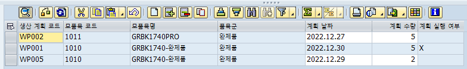

# 25. 찾아 볼 ALV LAYOUT, STYLE
            
## 특정 조건에 EDIT ENABLE, DISABLE 예시1.

```abap
*&---------------------------------------------------------------------*
*& Form GET_DATA
*&---------------------------------------------------------------------*
*& text
*&---------------------------------------------------------------------*
*& -->  p1        text
*& <--  p2        text
*&---------------------------------------------------------------------*
FORM get_data .

  SELECT *
    INTO CORRESPONDING FIELDS OF TABLE GT_WORKPL
    FROM ZTJ_WORKPLAN.

  LOOP AT GT_WORKPL INTO GS_WORKPL.
    IF GS_WORKPL-PLAN_CONFIRM = 'X'.
      GS_STYLE-FIELDNAME = 'PLAN_DATE'.
      GS_STYLE-STYLE = CL_GUI_ALV_GRID=>MC_STYLE_DISABLED.
      APPEND GS_STYLE TO GS_WORKPL-STYLE.
      CLEAR GS_STYLE.

      GS_STYLE-FIELDNAME = 'PLAN_QT'.
      GS_STYLE-STYLE = CL_GUI_ALV_GRID=>MC_STYLE_DISABLED.
      APPEND GS_STYLE TO GS_WORKPL-STYLE.
      CLEAR GS_STYLE.
    ENDIF.
    MODIFY GT_WORKPL FROM GS_WORKPL.
    CLEAR GS_WORKPL.
  ENDLOOP.

ENDFORM.

*&---------------------------------------------------------------------*
*& Form FIELD_CATALOG
*&---------------------------------------------------------------------*
*& text
*&---------------------------------------------------------------------*
*& -->  p1        text
*& <--  p2        text
*&---------------------------------------------------------------------*
  GS_FCAT-FIELDNAME = 'PLAN_DATE'.
  GS_FCAT-COLTEXT = '계획 날짜'.
  GS_FCAT-OUTPUTLEN = 15.
  GS_FCAT-EDIT = 'X'.
  GS_FCAT-REF_TABLE = 'ADCP'.
  GS_FCAT-REF_FIELD = 'DATE_FROM'.
  GS_FCAT-INTTYPE = 'D'.
  APPEND GS_FCAT TO GT_FCAT.
  CLEAR GS_FCAT.

  GS_LAYOUT-STYLEFNAME = 'STYLE'.
  
 *&---------------------------------------------------------------------*
*& Form DISPLAY_ALV
*&---------------------------------------------------------------------*
*& text
*&---------------------------------------------------------------------*
*& -->  p1        text
*& <--  p2        text
*&---------------------------------------------------------------------*

  CALL METHOD gc_grid->set_table_for_first_display
    EXPORTING
      is_layout                     = GS_LAYOUT
    CHANGING
      it_outtab                     = GT_WORKPL
      it_fieldcatalog               = GT_FCAT.
  ENDFORM.
```



## 특정 조건에 EDIT ENABLE, DISABLE 예시2.

우선 DISABLED STYLE PERFROM 문을 만들어 준다.

```abap
*&---------------------------------------------------------------------*
*&      Form  DISABLED_STYLE
*&---------------------------------------------------------------------*
*       text
*----------------------------------------------------------------------*
*  -->  p1        text
*  <--  p2        text
*----------------------------------------------------------------------*
FORM DISABLED_STYLE .
  DATA : LT_ZT2302_03 LIKE TABLE OF ZT2302_03 WITH HEADER LINE.

  SELECT BUKRS BUTXT
    FROM ZT2302_03
    INTO CORRESPONDING FIELDS OF TABLE LT_ZT2302_03.

  LOOP AT GT_DISPLAY2.
    READ TABLE LT_ZT2302_03 WITH KEY BUKRS = GT_DISPLAY2-BUKRS.
    IF SY-SUBRC = 0.
      GS_STYLE-FIELDNAME = 'BUKRS'.
      GS_STYLE-STYLE = CL_GUI_ALV_GRID=>MC_STYLE_DISABLED.

*      MODIFY GT_DISPLAY2-STYLE FROM GS_STYLE.
      APPEND GS_STYLE TO GT_DISPLAY2-STYLE.
      CLEAR GS_STYLE.

      MODIFY GT_DISPLAY2.
      CLEAR GT_DISPLAY2.
    ENDIF.
  ENDLOOP.
ENDFORM.                    " DISABLED_STYLE
```

```abap
REPORT  ZIT2302_21 MESSAGE-ID ME.

INCLUDE ZIT2302_21_2_TOP.
INCLUDE ZIT2302_21_2_CLS.
INCLUDE ZIT2302_21_2_SCR.
INCLUDE ZIT2302_21_2_PBO.
INCLUDE ZIT2302_21_2_PAI.
INCLUDE ZIT2302_21_2_F01.

INITIALIZATION.
  PERFORM INITIALIZATION.

START-OF-SELECTION.
  PERFORM SELECCT_DATA.
  PERFORM NOTI.
  PERFORM PROCESS_DATA.
  PERFORM DISABLED_STYLE.

END-OF-SELECTION.
  CHECK SY-BATCH IS INITIAL. "프로그램이 백그라운드 작업으로 실행되고 있는지 확인
    CALL SCREEN 0100.
```

만약에 PERFROM PROCESS_DATA에 PERFORM DISABLED_STYLE을 넣어두면 STYLE필드를 APPEND 하는 과정에서 왜인지 덤프가 발생한다. 따로 적어주었더니 오류가 나지 않는다.

맨 처음 화면에 뿌려줄때 값이 있으면 특정 조건에 의해 필드를 EDIT DISABLED 시켜주어야 하기 때문에 START-OF-SELECTION 에 넣어준다.

값이 만약에 계속 바뀌어서 GRID와 SELECT들을 수시로 REFRESH 해준다면, 다음과 같이 그 사이에도 STYLE을 끼워주어야 한다.

```abap
*&---------------------------------------------------------------------*
*&      Form  ALV_REFRESH_GRID1
*&---------------------------------------------------------------------*
*       text
*----------------------------------------------------------------------*
*  -->  p1        text
*  <--  p2        text
*----------------------------------------------------------------------*
FORM ALV_REFRESH_GRID .
  CLEAR : GT_DISPLAY[], GT_DISPLAY2[], GT_DISPLAY3[].

  PERFORM SELECCT_DATA.
  PERFORM PROCESS_DATA.
  PERFORM DISABLED_STYLE.

  PERFORM DROPDOWN_LIST.
  PERFORM REFRESH_GRID_0100.
  PERFORM REFRESH_GRID2_0100.
  PERFORM REFRESH_GRID3_0100.

ENDFORM.                    " ALV_REFRESH_GRID1
```

그 후 LAYOUT을 적용시켜주고 싶다면 INIT_LAYOUT_0100과 같은 PERFORM문에 GS_LAYOUT-STYLEFNAME = 'STYLE' 을 다음과 같이 넣어주어야 한다.

```abap
*&---------------------------------------------------------------------*
*&      Form  INIT_LAYOUT_0100
*&---------------------------------------------------------------------*
*       text
*----------------------------------------------------------------------*
*  -->  p1        text
*  <--  p2        text
*----------------------------------------------------------------------*
FORM INIT_LAYOUT_0100 .
  DATA: LV_INDEX(1000).

*  GS_LAYOUT-TOTALS_BEF = P_TOT. "S01 참조

  GS_LAYOUT-EDIT_MODE  = ABAP_FALSE.
  GS_LAYOUT-ZEBRA      = ABAP_TRUE.
  GS_LAYOUT-CWIDTH_OPT = ABAP_TRUE.


  GS_LAYOUT-SEL_MODE   = 'D'.     "B:단일,C:복수,D:셀,A:행/열
  GS_LAYOUT-BOX_FNAME  = SPACE.
  GS_LAYOUT-NO_ROWMARK = SPACE.
  GS_LAYOUT-SMALLTITLE = 3.
  GS_LAYOUT-STYLEFNAME = 'STYLE'.

*  gs_layout-ctab_fname = 'CELLTAB'.
*  gs_layout-info_fname = 'COLOR'.

  DESCRIBE TABLE GT_DISPLAY LINES LV_INDEX.
  CONDENSE LV_INDEX NO-GAPS.
  CONCATENATE 'Lines(' LV_INDEX ')' INTO GS_LAYOUT-GRID_TITLE.

ENDFORM.                    " INIT_LAYOUT_0100
```
