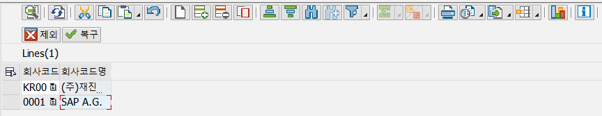
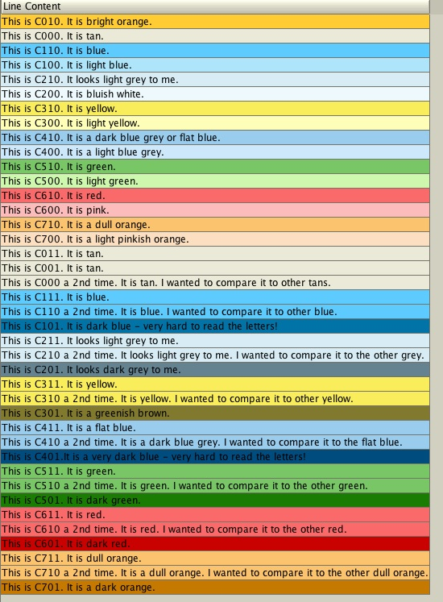

# 25. 찾아 볼 ALV CONTROL
            
## 1. 특정 조건에 EDIT ENABLE, DISABLE 예시1.

```abap
*&---------------------------------------------------------------------*
*& Form GET_DATA
*&---------------------------------------------------------------------*
*& text
*&---------------------------------------------------------------------*
*& -->  p1        text
*& <--  p2        text
*&---------------------------------------------------------------------*
FORM get_data .

  SELECT *
    INTO CORRESPONDING FIELDS OF TABLE GT_WORKPL
    FROM ZTJ_WORKPLAN.

  LOOP AT GT_WORKPL INTO GS_WORKPL.
    IF GS_WORKPL-PLAN_CONFIRM = 'X'.
      GS_STYLE-FIELDNAME = 'PLAN_DATE'.
      GS_STYLE-STYLE = CL_GUI_ALV_GRID=>MC_STYLE_DISABLED.
      APPEND GS_STYLE TO GS_WORKPL-STYLE.
      CLEAR GS_STYLE.

      GS_STYLE-FIELDNAME = 'PLAN_QT'.
      GS_STYLE-STYLE = CL_GUI_ALV_GRID=>MC_STYLE_DISABLED.
      APPEND GS_STYLE TO GS_WORKPL-STYLE.
      CLEAR GS_STYLE.
    ENDIF.
    MODIFY GT_WORKPL FROM GS_WORKPL.
    CLEAR GS_WORKPL.
  ENDLOOP.

ENDFORM.

*&---------------------------------------------------------------------*
*& Form FIELD_CATALOG
*&---------------------------------------------------------------------*
*& text
*&---------------------------------------------------------------------*
*& -->  p1        text
*& <--  p2        text
*&---------------------------------------------------------------------*
  GS_FCAT-FIELDNAME = 'PLAN_DATE'.
  GS_FCAT-COLTEXT = '계획 날짜'.
  GS_FCAT-OUTPUTLEN = 15.
  GS_FCAT-EDIT = 'X'.
  GS_FCAT-REF_TABLE = 'ADCP'.
  GS_FCAT-REF_FIELD = 'DATE_FROM'.
  GS_FCAT-INTTYPE = 'D'.
  APPEND GS_FCAT TO GT_FCAT.
  CLEAR GS_FCAT.

  GS_LAYOUT-STYLEFNAME = 'STYLE'.
  
 *&---------------------------------------------------------------------*
*& Form DISPLAY_ALV
*&---------------------------------------------------------------------*
*& text
*&---------------------------------------------------------------------*
*& -->  p1        text
*& <--  p2        text
*&---------------------------------------------------------------------*

  CALL METHOD gc_grid->set_table_for_first_display
    EXPORTING
      is_layout                     = GS_LAYOUT
    CHANGING
      it_outtab                     = GT_WORKPL
      it_fieldcatalog               = GT_FCAT.
  ENDFORM.
```


## 1. 특정 조건에 EDIT ENABLE, DISABLE 예시2.

우선 DISABLED STYLE PERFROM 문을 만들어 준다.

```abap
*&---------------------------------------------------------------------*
*&      Form  DISABLED_STYLE
*&---------------------------------------------------------------------*
*       text
*----------------------------------------------------------------------*
*  -->  p1        text
*  <--  p2        text
*----------------------------------------------------------------------*
FORM DISABLED_STYLE .
  DATA : LT_ZT2302_03 LIKE TABLE OF ZT2302_03 WITH HEADER LINE.

  SELECT BUKRS BUTXT
    FROM ZT2302_03
    INTO CORRESPONDING FIELDS OF TABLE LT_ZT2302_03.

  LOOP AT GT_DISPLAY2.
    READ TABLE LT_ZT2302_03 WITH KEY BUKRS = GT_DISPLAY2-BUKRS.
    IF SY-SUBRC = 0.
      GS_STYLE-FIELDNAME = 'BUKRS'.
      GS_STYLE-STYLE = CL_GUI_ALV_GRID=>MC_STYLE_DISABLED.

*      MODIFY GT_DISPLAY2-STYLE FROM GS_STYLE.
      APPEND GS_STYLE TO GT_DISPLAY2-STYLE.
      CLEAR GS_STYLE.

      MODIFY GT_DISPLAY2.
      CLEAR GT_DISPLAY2.
    ENDIF.
  ENDLOOP.
ENDFORM.                    " DISABLED_STYLE
```

```abap
REPORT  ZIT2302_21 MESSAGE-ID ME.

INCLUDE ZIT2302_21_2_TOP.
INCLUDE ZIT2302_21_2_CLS.
INCLUDE ZIT2302_21_2_SCR.
INCLUDE ZIT2302_21_2_PBO.
INCLUDE ZIT2302_21_2_PAI.
INCLUDE ZIT2302_21_2_F01.

INITIALIZATION.
  PERFORM INITIALIZATION.

START-OF-SELECTION.
  PERFORM SELECCT_DATA.
  PERFORM NOTI.
  PERFORM PROCESS_DATA.
  PERFORM DISABLED_STYLE.

END-OF-SELECTION.
  CHECK SY-BATCH IS INITIAL. "프로그램이 백그라운드 작업으로 실행되고 있는지 확인
    CALL SCREEN 0100.
```

만약에 PERFROM PROCESS_DATA에 PERFORM DISABLED_STYLE을 넣어두면 STYLE필드를 APPEND 하는 과정에서 왜인지 덤프가 발생한다. 따로 적어주었더니 오류가 나지 않는다.

맨 처음 화면에 뿌려줄때 값이 있으면 특정 조건에 의해 필드를 EDIT DISABLED 시켜주어야 하기 때문에 START-OF-SELECTION 에 넣어준다.

값이 만약에 계속 바뀌어서 GRID와 SELECT들을 수시로 REFRESH 해준다면, 다음과 같이 그 사이에도 STYLE을 끼워주어야 한다.

```abap
*&---------------------------------------------------------------------*
*&      Form  ALV_REFRESH_GRID1
*&---------------------------------------------------------------------*
*       text
*----------------------------------------------------------------------*
*  -->  p1        text
*  <--  p2        text
*----------------------------------------------------------------------*
FORM ALV_REFRESH_GRID .
  CLEAR : GT_DISPLAY[], GT_DISPLAY2[], GT_DISPLAY3[].

  PERFORM SELECCT_DATA.
  PERFORM PROCESS_DATA.
  PERFORM DISABLED_STYLE.

  PERFORM DROPDOWN_LIST.
  PERFORM REFRESH_GRID_0100.
  PERFORM REFRESH_GRID2_0100.
  PERFORM REFRESH_GRID3_0100.

ENDFORM.                    " ALV_REFRESH_GRID1
```

그 후 LAYOUT을 적용시켜주고 싶다면 INIT_LAYOUT_0100과 같은 PERFORM문에 GS_LAYOUT-STYLEFNAME = 'STYLE' 을 다음과 같이 넣어주어야 한다.

```abap
*&---------------------------------------------------------------------*
*&      Form  INIT_LAYOUT_0100
*&---------------------------------------------------------------------*
*       text
*----------------------------------------------------------------------*
*  -->  p1        text
*  <--  p2        text
*----------------------------------------------------------------------*
FORM INIT_LAYOUT_0100 .
  DATA: LV_INDEX(1000).

*  GS_LAYOUT-TOTALS_BEF = P_TOT. "S01 참조

  GS_LAYOUT-EDIT_MODE  = ABAP_FALSE.
  GS_LAYOUT-ZEBRA      = ABAP_TRUE.
  GS_LAYOUT-CWIDTH_OPT = ABAP_TRUE.


  GS_LAYOUT-SEL_MODE   = 'D'.     "B:단일,C:복수,D:셀,A:행/열
  GS_LAYOUT-BOX_FNAME  = SPACE.
  GS_LAYOUT-NO_ROWMARK = SPACE.
  GS_LAYOUT-SMALLTITLE = 3.
  GS_LAYOUT-STYLEFNAME = 'STYLE'.

*  gs_layout-ctab_fname = 'CELLTAB'.
*  gs_layout-info_fname = 'COLOR'.

  DESCRIBE TABLE GT_DISPLAY LINES LV_INDEX.
  CONDENSE LV_INDEX NO-GAPS.
  CONCATENATE 'Lines(' LV_INDEX ')' INTO GS_LAYOUT-GRID_TITLE.

ENDFORM.                    " INIT_LAYOUT_0100
```

이렇게 한 LAYOUT으로 조절 할 수도 있지만, GRID가 3개면 LAYOUT도 3개, GRID REFRESH에서 GS_LAYOUT도 모두 지정해 준다.

```abap
*&---------------------------------------------------------------------*
*&      Module  ALV_INIT_DISPLAY_0100  OUTPUT
*&---------------------------------------------------------------------*
*       text
*----------------------------------------------------------------------*
MODULE ALV_INIT_DISPLAY_0100 OUTPUT.
  "-- 화면의  GRID가 BOUND되었는지 확인한다.
  IF GR_DOCK1 IS INITIAL.

    "-- GRID의 INSTANCE를 생성한다.
    PERFORM CREATE_INSTANCE_0100.

    "-- GRID의 LAYOUT 속성을 정의한다.
    PERFORM INIT_LAYOUT_0100.
    PERFORM INIT_LAYOUT2_0100.
    PERFORM INIT_LAYOUT3_0100.

    "-- ALV Standard toolbar button cotrol
*    PERFORM SET_GRID_EXCLUDE_0100.

    "-- ALV Sort
*    perform alv_sort_0100.

    "-- Field Attribute을 사용자의 요구사항에 맞게 변경
    PERFORM APPEND_FIELDCAT_0100.

    "-- ALV Events 등록
    PERFORM REGIST_ALV_EVENT_0100.

    PERFORM DROPDOWN_LIST.

    "-- ALV Display
    PERFORM DISPLAY_ALV_GRID_0100.
*
**    "-- ALV Title
*    *    PERFORM DISPLAY_ALV_TITLE_0100.

  ELSE.

    PERFORM REFRESH_GRID_0100.
    PERFORM REFRESH_GRID2_0100.
    PERFORM REFRESH_GRID3_0100.

  ENDIF.
ENDMODULE.                 " ALV_INIT_DISPLAY_0100  OUTPUT
```



## 2. ALV ROW COLOR

1 TOP에 COLOR 필드 추가

```abap
DATA : BEGIN OF GS_DISPLAY3,
        FLDATE TYPE SFLIGHT-FLDATE,
        ZCODE TYPE ZTCOTJ_01-ZCODE,
        PLANETYPE TYPE SFLIGHT-PLANETYPE,
        PAYMENTSUM TYPE SFLIGHT-PAYMENTSUM,
        ZMAX_SUM TYPE SFLIGHT-SEATSMAX,
        ZPER_SUM TYPE SFLIGHT-SEATSOCC,
        ZPRICE TYPE SFLIGHT-PAYMENTSUM,
        FLTIME TYPE SPFLI-FLTIME,
        CURRENCY TYPE SFLIGHT-CURRENCY,
        COLOR(4),
       END OF GS_DISPLAY3,
       GT_DISPLAY3 LIKE TABLE OF GS_DISPLAY3.
```

2 로직에 색상 입력

```abap
LOOP AT GT_DATA3 INTO GS_DATA3 WHERE FLDATE IN S_FLDAT AND ZCODE IN S_ZCODE.
    GS_DATA3-ZMAX_SUM = GS_DATA3-SEATSMAX + GS_DATA3-SEATSMAX_B + GS_DATA3-SEATSMAX_F.
    GS_DATA3-ZPER_SUM = GS_DATA3-SEATSOCC + GS_DATA3-SEATSOCC_B + GS_DATA3-SEATSOCC_F.
    GS_DATA3-ZPRICE = GS_DATA3-PAYMENTSUM / GS_DATA3-ZPER_SUM.

    MOVE-CORRESPONDING GS_DATA3 TO GS_DISPLAY3.
    IF GS_DISPLAY3-ZMAX_SUM = GS_DISPLAY3-ZPER_SUM.
      GS_DISPLAY3-COLOR = 'C600'.
    ENDIF.
    APPEND GS_DISPLAY3 TO GT_DISPLAY3.
    CLEAR GS_DISPLAY3.
ENDLOOP.
```

3 LAYOUT STRUCTURE 입력

```abap
GS_LAYOUT-INFO_FNAME = 'COLOR'.
```

4 SET_TABLE_FOR_FIRST_DISPLAY에 GS_LAYOUT 등록

```abap
  CALL METHOD GO_GRID3->SET_TABLE_FOR_FIRST_DISPLAY
    EXPORTING
*      I_BUFFER_ACTIVE               = I_BUFFER_ACTIVE
*      I_BYPASSING_BUFFER            = I_BYPASSING_BUFFER
*      I_CONSISTENCY_CHECK           = I_CONSISTENCY_CHECK
*      I_STRUCTURE_NAME              = I_STRUCTURE_NAME
*      IS_VARIANT                    = IS_VARIANT
*      I_SAVE                        = I_SAVE
*      I_DEFAULT                     = 'X'
      IS_LAYOUT                     = GS_LAYOUT
*      IS_PRINT                      = IS_PRINT
*      IT_SPECIAL_GROUPS             = IT_SPECIAL_GROUPS
*      IT_TOOLBAR_EXCLUDING          = IT_TOOLBAR_EXCLUDING
*      IT_HYPERLINK                  = IT_HYPERLINK
*      IT_ALV_GRAPHICS               = IT_ALV_GRAPHICS
*      IT_EXCEPT_QINFO               = IT_EXCEPT_QINFO
*      IR_SALV_ADAPTER               = IR_SALV_ADAPTER
    CHANGING
      IT_OUTTAB                     = GT_DISPLAY3
      IT_FIELDCATALOG               = GT_FCAT3
*      IT_SORT                       = IT_SORT
*      IT_FILTER                     = IT_FILTER
*    EXCEPTIONS
*      INVALID_PARAMETER_COMBINATION = 1
*      PROGRAM_ERROR                 = 2
*      TOO_MANY_LINES                = 3
*      OTHERS                        = 4
          .
```

### 색상 표


## 3. ALV TOOLBAR CONTROL

HANDLE TOOLBAR CLASS 선언.

```abap
*---------------------------------------------------------------------*
*       CLASS LCL_EVENT_RECEIVER DEFINITION
*---------------------------------------------------------------------*
CLASS LCL_EVENT_RECEIVER DEFINITION.
  PUBLIC SECTION.

    METHODS : HANDLE_TOOLBAR FOR EVENT TOOLBAR OF CL_GUI_ALV_GRID
                             IMPORTING E_OBJECT E_INTERACTIVE.
ENDCLASS.

*---------------------------------------------------------------------*
* LOCAL CLASSES: IMPLEMENTATION                                       *
*---------------------------------------------------------------------*
CLASS LCL_EVENT_RECEIVER IMPLEMENTATION.

  METHOD HANDLE_TOOLBAR.
    PERFORM EVENT_HANDLE_TOOLBAR USING E_OBJECT
                                       E_INTERACTIVE.
  ENDMETHOD.

ENDCLASS.
```

삭제할 아이콘들을 쭉 적어줌

```abap
*&---------------------------------------------------------------------*
*&      Form  EVENT_HANDLE_TOOLBAR
*&---------------------------------------------------------------------*
*       text
*----------------------------------------------------------------------*
*      -->P_E_OBJECT  text
*      -->P_E_INTERACTIVE  text
*----------------------------------------------------------------------*
FORM EVENT_HANDLE_TOOLBAR  USING    P_OBJECT TYPE REF TO CL_ALV_EVENT_TOOLBAR_SET
                                    P_INTERACTIVE TYPE CHAR01.
  LOOP AT P_OBJECT->MT_TOOLBAR INTO GS_TOOLBAR.
    CASE GS_TOOLBAR-FUNCTION.
      WHEN '&CHECK'
        OR '&REFRESH'
        OR '&LOCAL&CUT'
        OR '&LOCAL&APPEND'
        OR '&LOCAL&INSERT_ROW'
        OR '&LOCAL&DELETE_ROW'
        OR '&LOCAL&COPY_ROW'
        OR '&LOCAL'
        OR '&MB_VIEW'
        OR '&PRINT_BACK'
        OR '&VIEW'
        OR '&COLO'
        OR '&GRAPH'
        OR '&INFO'.
        DELETE P_OBJECT->MT_TOOLBAR WHERE FUNCTION = GS_TOOLBAR-FUNCTION.
    ENDCASE.
  ENDLOOP.
ENDFORM.                    " EVENT_HANDLE_TOOLBAR
```

그리고 SET HANDLER로 EVENT를 불러와 줌

```abap
DATA : LO_EVENT_RECEIVER TYPE REF TO LCL_EVENT_RECEIVER.
SET HANDLER LO_EVENT_RECEIVER->HANDLE_TOOLBAR FOR GO_GRID1.
```

## 4. SAVE LAYOUT 레이아웃 저장. VARIANT

저장한 레이아웃을 파라미터에 입력해 ALV에 적용하는 것.

```abap
DATA : GS_VARIANT TYPE DISVARIANT.

GS_VARIANT-REPORT = SY-REPID.
GS_VARIANT-USERNAME = SY-UNAME.

CALL METHOD GO_GRID1->SET_TABLE_FOR_FIRST_DISPLAY
    EXPORTING
*      I_BUFFER_ACTIVE               = I_BUFFER_ACTIVE
*      I_BYPASSING_BUFFER            = I_BYPASSING_BUFFER
*      I_CONSISTENCY_CHECK           = I_CONSISTENCY_CHECK
*      I_STRUCTURE_NAME              = I_STRUCTURE_NAME
      IS_VARIANT                    = GS_VARIANT
*      I_SAVE                        = I_SAVE
*      I_DEFAULT                     = 'X'
      IS_LAYOUT                     = GS_LAYOUT
*      IS_PRINT                      = IS_PRINT
*      IT_SPECIAL_GROUPS             = IT_SPECIAL_GROUPS
*      IT_TOOLBAR_EXCLUDING          = IT_TOOLBAR_EXCLUDING
*      IT_HYPERLINK                  = IT_HYPERLINK
*      IT_ALV_GRAPHICS               = IT_ALV_GRAPHICS
*      IT_EXCEPT_QINFO               = IT_EXCEPT_QINFO
*      IR_SALV_ADAPTER               = IR_SALV_ADAPTER
    CHANGING
      IT_OUTTAB                     = GT_DISPLAY1
      IT_FIELDCATALOG               = GT_FCAT1
      IT_SORT                       = GT_SORT
*      IT_FILTER                     = IT_FILTER
          .
```
