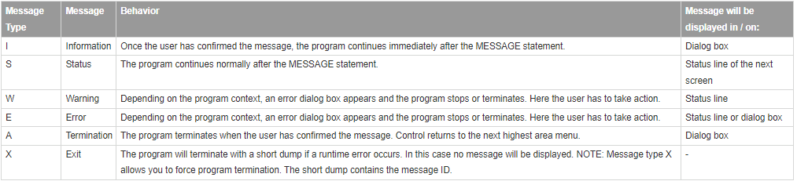

# 3. message type
           

I : information 아이콘과 함께 팝업창이 뜸

S : check표시와 함께 아래 상태표시줄에 뜸

W :  display like 'W'를 하면 경고 표시와 함께 팝업 또는 상태표시줄에 뜨지만, 바로 'W'를 사용하면 프로그램이 종료됨

E :  error 표시와 함께 상태표시줄에 뜸

A : 프로그램이 종료됨

X : 런타임에러와함께 종료됨
