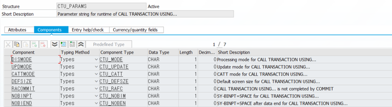

# 30. BDC, BAPI, 엑셀
# EXCEL DOWNLOAD, UPLOAD
## EXCEL DOWNLOAD

엑셀 다운로드 버튼 USER-COMMAND.

불러 올 엑셀 양식은 SMW0에 저장 한다.


먼저 저장된 엑셀 양식을 불러온다.

```abap
FORM GET_WWWDATA USING P_OBJID.
  SELECT SINGLE *
    INTO CORRESPONDING FIELDS OF WWWDATA_ITEM
    FROM WWWDATA
    WHERE OBJID = P_OBJID.
ENDFORM.                    " GET_WWWDATA
```

그 다음 BROWSE 창을 생성 한 후 컴퓨터에 다운받는 메세지를 호출하여 저장한다.

```abap
FORM DOWNLOAD_FILE USING P_FILENAME TYPE STRING.
  DATA : TITLE TYPE STRING,
         FILENAME TYPE STRING,
         PATH TYPE STRING,
         FULLPATH TYPE STRING,
         USER_ACTION TYPE I.

  DATA : L_FILE  TYPE RLGRAP-FILENAME.

  "1. EXCEL DOWNLOAD BROWSE 창 생성
  TITLE = TEXT-T02.

  CALL METHOD CL_GUI_FRONTEND_SERVICES=>FILE_SAVE_DIALOG
    EXPORTING
      WINDOW_TITLE         = TITLE
      DEFAULT_EXTENSION    = 'XLS'
      DEFAULT_FILE_NAME    = P_FILENAME
      FILE_FILTER          = 'Only Excel Files (*.xls)|*.XLS|'
      INITIAL_DIRECTORY    = 'C:\'
    CHANGING
      FILENAME             = FILENAME
      PATH                 = PATH "DIRECTORY 경로
      FULLPATH             = FULLPATH "DIRECTORY + 파일 경로
          .

  L_FILE = FULLPATH.

  "DOWNLOAD
  IF FULLPATH IS NOT INITIAL.
    "DOWNLOAD FILE
    CALL FUNCTION 'DOWNLOAD_WEB_OBJECT'
      EXPORTING
        KEY               = WWWDATA_ITEM
        DESTINATION       = L_FILE "RLGRAP-FILENAME으로 넣어주어야 함
              .

    "SERVICE 창 생성
    CALL METHOD CL_GUI_FRONTEND_SERVICES=>EXECUTE
     EXPORTING
       DOCUMENT               = FULLPATH
            .
  ENDIF.
ENDFORM.                    " SAVE_FILE
```

## EXCEL UPLOAD

엑셀 파일 입력창 구성

```abap
"창 구성
SELECTION-SCREEN BEGIN OF BLOCK BL1 WITH FRAME TITLE TEXT-T01.
  PARAMETERS : P_FILE TYPE RLGRAP-FILENAME OBLIGATORY DEFAULT 'C:\' MODIF ID ID1.
SELECTION-SCREEN END OF BLOCK BL1.

"엑셀 업로드
AT SELECTION-SCREEN ON VALUE-REQUEST FOR P_FILE.
  PERFORM GET_UPLOAD_FILE_NAME.
```

각 EXPORTING값에 올린 엑셀에따른 값을 넣으면 인터널 테이블로 (INTERN) 나옴.
이 인터널 테이블 GT_EXCEL은 ROW, COLUMN, VALUE 필드로 되어있다.
예시)
ROW  COLUMN  VALUE
1    1       T001
1    2       2012.10.01
...

```abap
FORM GET_DATA_FROM_EXCEL USING P_BEGINCOL P_BEGINROW P_ENDCOL P_ENDROW.
  "엑셀을 INT로 CONVERT하는 FUNCTION.
  CALL FUNCTION 'ALSM_EXCEL_TO_INTERNAL_TABLE'
    EXPORTING
      FILENAME    = P_FILE
      I_BEGIN_COL = P_BEGINCOL
      I_BEGIN_ROW = P_BEGINROW
      I_END_COL   = P_ENDCOL
      I_END_ROW   = P_ENDROW
    TABLES
      INTERN      = GT_EXCEL. "엑셀 행,열 가져옴

  PERFORM READ_EXCEL_DATA.
ENDFORM.                    " GET_DATA_FROM_EXCEL
```

이 인터널 테이블을 동적으로 읽어서 인터널 테이블에 엑셀처럼 인터널테이블을 만들어 줌.

```abap
FORM READ_EXCEL_DATA.
  DATA : ORF_1 TYPE REF TO CX_ROOT.

  FIELD-SYMBOLS <FS> TYPE ANY.
  "엑셀 필드 하나씩 읽어옴
  LOOP AT GT_EXCEL INTO GS_EXCEL.
    ASSIGN COMPONENT GS_EXCEL-COL OF STRUCTURE GS_DATA TO <FS>.
    <FS> = GS_EXCEL-VALUE.

    AT END OF ROW.
      APPEND GS_DATA TO GT_DATA.
      CLEAR GS_DATA.
    ENDAT.
  ENDLOOP.
ENDFORM.                    " READ_EXCEL_DATA
```

# BDC (Batch Data Communication)
BDC는 사용자가 Macro를 사용하여 SAP프로그램을 자동으로 수행하는 것과 같은 형태의 기능과 유사.

즉 단순 반복작업을 최소화하여 백그라운드로 수행 가능하도록 해줌. 
사용자가 직접 프로그램에서 정해진 시나리오대로 작업하는 절차를 레코딩 수행하는 것으로 직접 DB table에 입력 하는것이 아님.

### BDC 구성 요소


### 1. BDC 준비물
BDCDATA : SHDB라는 레코딩 정보를 생성하는 프로그램에서 발췌된 value들을 해당 structure에 입력


BDCMSGCOLL : BDC수행이 완료 된 후, 성공이나 실패 여부에 대한 Message 정보를 담아주며 "성공 유무에 대한 이유 정보"를 같이 return 해줌.


CTUPARAMS


DISMODE: MODE 옵션과 동일

UPDMODE: UPDATE 옵션과 동일

CATTMODE: CATT 모드설정

                   ' ' CATT 사용 안 함

                   'N' single-screen control이 없는 CATT

                   'A' single-screen control이 있는 CATT

DEFSIZE:  기본 윈도우 사이즈 설정

RACOMMIT:COMMIT WORK에서 트랜잭션 종료하지 않음.

NOBINPT:Batch Input Mode 사용 안 함.

NOBIEND:DISMODE가 'E' 상태일 때만 설정이 가능하며, 시스템 에레가 발생하면 Background에서 수행 중인 BDC가 Foreground로 전환되고 스크린이 조회 됨.

CTU_PARAMS의 옵션이 DISMODE와 CALL TRANSACTION의 MODE 는 같은 기능을 수행하며, 중복해서 사용할 수 없다. UPDMODE 속성도 동일.

mode : 조회 모드 설정.

 A   화면을 조회하면서 트랜잭션 수행

 E   에러가 발생할 경우에만 화면 조회

 N   화면을 표시하지 않음
update : update mode

 S    Synchronous Update

 A    Asynchronous Update

 L    Local Update

TYPES : GTY_BDC TYPE BDCDATA,

        GTY_MSG TYPE BDCMSGCOLL.


## BDC 예시

### run BDC

BDCDATA 테이블에 있는 필드 PROGRAM, DYNPRO, DYNBEGIN, FNAM, FVAL에 값을 넣어주면 된다.
그래서 다음과 같이 BDC테이블과 스트럭쳐를 선언 해 준다.

```abap
DATA : GT_BDC LIKE TABLE OF BDCDATA,
       GS_BDC LIKE LINE OF GT_BDC,
       GT_MSG LIKE TABLE OF BDCMSGCOLL,
       GS_MSG LIKE LINE OF GT_MSG.
```

그리고 만약 화면 시작 DYNBEGIN = 'X' 이면 화면번호 DYNPRO, 프로그램명 PROGRAM 을 입력해주고,
화면이 시작 된 후 필드에 값을 넣어주어야 하는 것이면 필드 이름 FNAM, 필드값 FVAL를 입력해 준다.

```abap
FORM GET_BDC_DATA  USING    P_CHECK
                            P_NAME
                            P_VALUE.

  IF P_CHECK = 'X'.
    GS_BDC-PROGRAM = P_NAME.
    GS_BDC-DYNPRO = P_VALUE.
    GS_BDC-DYNBEGIN = P_CHECK.
  ELSE.
    GS_BDC-FNAM = P_NAME.
    GS_BDC-FVAL = P_VALUE.
  ENDIF.

  APPEND GS_BDC TO GT_BDC.
  CLEAR GS_BDC.

ENDFORM.                    " GET_BDC_DATA
```

이 BDC PERFORM문을 이용해서 다음과 같이 매크로를 구성하면 된다.

```abap
FORM BDC_PROGRAM .
  CLEAR : GT_BDC.

  PERFORM GET_BDC_DATA USING : 'X' 'ZCOTJ_01'   '1000',
                               ' ' 'BDC_CURSOR' 'P_RADI2',
                               ' ' 'BDC_OKCODE' '=RADI',
                               ' ' 'P_RADI1'    ' ',
                               ' ' 'P_RADI2'    'X',

                               'X' 'ZCOTJ_01'   '1000',
                               ' ' 'BDC_CURSOR' 'P_RADI2',
                               ' ' 'BDC_OKCODE' '=ONLI',
                               ' ' 'P_RADI2'    'X'.

  LOOP AT GT_DATA INTO GS_DATA.
    PERFORM GET_BDC_DATA USING : 'X' 'ZCOTJ_01'   '0300',
                                 ' ' 'BDC_CURSOR' 'P_ZPNUM',
                                 ' ' 'BDC_OKCODE' '=RSRV',
                                 ' ' 'P_ZNUM'     GS_DATA-ZOCUP_NUM,
                                 ' ' 'P_ZDATE'    GS_DATA-FLDATE,
                                 ' ' 'P_ZCODE'    GS_DATA-ZCODE,
                                 ' ' 'P_ZPNUM'    GS_DATA-ZPER_NUM,

                                 'X' 'ZCOTJ_01'   '0400',
                                 ' ' 'BDC_OKCODE' '=RSRV',

                                 'X' 'ZCOTJ_01'   '0400',
                                 ' ' 'BDC_OKCODE' '/EBACK'.
  ENDLOOP.

  PERFORM GET_BDC_DATA USING : 'X' 'ZCOTJ_01'   '0300',
                               ' ' 'BDC_OKCODE' '/EBACK',

                               'X' 'ZCOTJ_01'   '0200',
                               ' ' 'BDC_OKCODE' '/EBACK',

                               'X' 'ZCOTJ_01'   '0100',
                               ' ' 'BDC_OKCODE' '/EBACK',

                               'X' 'ZCOTJ_01'   '1000',
                               ' ' 'BDC_OKCODE' '/EBACK'.

  CALL TRANSACTION 'ZCOTJ_01' USING GT_BDC MODE 'A'.
ENDFORM.                    " BDC_PROGRAM
```

# BAPI (Buisness Application Programming Interface) : 학습 심화 필요

이하 밥피는 BDC처럼 자동으로 무언가를 불러 와주는 프로그램인데, BDC와 달리 레코드에 저장 해 둘 필요 없고, 레코드를 불러 올 필요 없이 바로 입력 해 주는 프로그램이다.

편리한 대신 function내에 파라메터들이 많아서 오류를 찾기가 힘들고 적절한 예제가 잘 없다...

## BAPI 예시

다음 예제 프로그램 에서도 gt_zco06이 따로 선언되어야 하고, 가져오는 테이블도 만들어져 있는 테이블이고,
function도 예제를 위한 커스텀 function이라 다른 테이블은 불러오지를 못한다..

```abap
form run_bapi .

  tables : zco01.

  data: l_except(1) type c.

  data: gt_zco06 like table of zco01 with header line.

  data : l_index(10) type c.


  loop at gt_itab into gs_itab.

  l_index = gs_itab-kstar.

  call function 'CONVERSION_EXIT_ALPHA_INPUT'
    exporting
      input         = l_index
   importing
      output        = l_index.
          .

  gt_zco06-kstar = l_index.        " 계정코드
  gt_zco06-wog05 = gs_itab-wog05.  " 금액

  append gt_zco06.

  call function 'ZINTERN_BUDGET'
    exporting
      m_gjahr  = gs_itab-gjahr    " 연도
      m_perbl  = gs_itab-perbl    " 월
      m_kostl  = gs_itab-kostl    " 코스트센터
    importing
      e_except = l_except
    tables
      zco06    = gt_zco06.

  clear : gt_zco06, gt_zco06[].

  endloop.

endform.                    " RUN_BAPI
```

물론 이 프로그램 이전에 엑셀에서 값을 읽어오기 위한 get data 와 read data가 필요하다.

```abap
form get_data_section.

  call function 'KCD_EXCEL_OLE_TO_INT_CONVERT'
    exporting
      filename    = p_file
      i_begin_col = 1
      i_begin_row = 1
      i_end_col   = 10
      i_end_row   = 5000
    tables
      intern      = g_xls_t.

  perform read_item_data.

endform.                    " GET_DATA_SECTION
```

```abap
form read_item_data.

  data: w_cnt  type i,
        w_row   like g_xls_t-row,
        w_col1  like g_xls_t-col, w_col2  like g_xls_t-col,
        w_col3  like g_xls_t-col, w_col4  like g_xls_t-col,
        w_col5  like g_xls_t-col. "W_COL6  LIKE G_XLS_T-COL.
*        W_COL7  LIKE G_XLS_T-COL, W_COL8  LIKE G_XLS_T-COL,
*        W_COL9  LIKE G_XLS_T-COL, W_COL10  LIKE G_XLS_T-COL.


  w_row = g_xls_t-row.                 " Header값, 총 row 수

  loop at g_xls_t.
    w_col1  =  g_xls_t-col.
    w_col2  =  w_col1 + 1.
    w_col3  =  w_col2 + 1.
    w_col4  =  w_col3 + 1.
    w_col5  =  w_col4 + 1.
*    W_COL6  =  W_COL5 + 1.
*    W_COL7  =  W_COL6 + 1.
*    W_COL8  =  W_COL7 + 1.
*    W_COL9  =  W_COL8 + 1.
*    W_COL10  =  W_COL9 + 1.

    w_cnt = g_xls_t-row + 1.           "처음 텍스트를 제외하기 위해서
    g_cnt = w_row - g_xls_t-row.       "실데이타가 들어있는 시작 row
    "AT FIRST 기능
    exit.
  endloop.

  g_start_row = w_cnt.                 "탭제외

  clear : gt_itab[].

  do g_cnt times.

    perform convert_excel_data :

    tables g_xls_t using g_start_row w_col1  gs_itab-gjahr,
    tables g_xls_t using g_start_row w_col2  gs_itab-perbl,
    tables g_xls_t using g_start_row w_col3  gs_itab-kostl,
    tables g_xls_t using g_start_row w_col4  gs_itab-kstar,
    tables g_xls_t using g_start_row w_col5  gs_itab-wog05.
*    TABLES G_XLS_T USING G_START_ROW W_COL6  GS_ITAB-scope.
*    TABLES G_XLS_T USING G_START_ROW W_COL7  GS_ITAB-KOSAR,
*    TABLES G_XLS_T USING G_START_ROW W_COL8  GS_ITAB-KHINR,
*    TABLES G_XLS_T USING G_START_ROW W_COL9  GS_ITAB-BUKRS,
*    TABLES G_XLS_T USING G_START_ROW W_COL10 GS_ITAB-GSBER.
    add  1  to g_start_row.

    append gs_itab to gt_itab.  clear  gs_itab.

  enddo.

endform.                    " READ_ITEM_DATA
```

## Project System Module에서 BAPI

프로젝트 시스템에서 BAPI는 다음과 같은 순서대로 사용 할 수 있다.

1. 로직의 처음에, BAPI_PS_INITIALIZATION를 사용해 준다.
2. 그 다음 필요한 만큼 개별 BAPI들을 사용한다.
3. 로직의 끝에 precommit ( BAPI_PS_PRECOMMIT )를 쓰고, BAPI_TRANSACTION_COMMIT를 commit work가 끝난 뒤에 써 준다.

## Example of use BAPI in Progject System Module

```abap
CALL FUNCTION 'BAPI_PS_INITIALIZATION'.
CALL FUNCTION 'BAPI_BUS2001_SET_STATUS'
 
PROJECT_DEFINITION               = LV_PRJDEF
\UNDO_SYSTEM_STATUS              =
*       UNDO_USER_STATUS         =
        SET_SYSTEM_STATUS        = LV_CLSD
*       SET_USER_STATUS          =
     IMPORTING
       RETURN                    = LV_RETURN
     TABLES
       E_RESULT                  = LT_RESULT
*              .
CALL FUNCTION 'BAPI_PS_PRECOMMIT'.
       TABLES
       ET_RETURN                 = IT_RETURN.
CALL FUNCTION 'BAPI_TRANSACTION_COMMIT'
* EXPORTING
*   WAIT                         =
* IMPORTING
*   RETURN                       =
```

관련 자료 : https://wiki.scn.sap.com/wiki/display/PLM/How+to+use+BAPI+in+Project+System+Module
