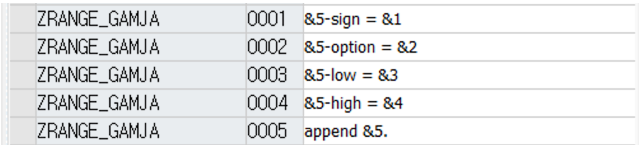

# 35. 매크로 (Macro, Define)

MACRO를 사용하려면 DEFINE함수를 써야한다.

MACRO는 LOCAL MACRO 와 GLOBAL MACRO로 나뉜다.

### LOCAL MACRO

```abap
SELECT-OPTIONS S_DATA FOR SCARR-CARRID.
DEFINE RANGE_DATA.
  APPEND VALUE #(
  SIGN = &1
  OPTION = &2
  LOW = &3
  HIGH = &4
  ) TO S_DATA.
END-OF-DEFINITION.

INITIALIZATION.
RANGE_DATA 'I' 'BT' 'AA' 'UA'.
```

이렇게 DEFINE 함수를 사용해서 넣고 싶은 로직을 넣고 불러 올 때에는 내가 선언한 MACRO 네임을 쓰고 넣을 값들을 입력해주면 된다.
프로그램 내에서 언제든지 불러와 사용 할 수 있다.

### GLOBAL MACRO
GLOBAL MACRO는 T-CODE SM30, TRMAC VIEW에서 만든다.

수정으로 들어가서 새 엔트리를 추가하면 된다.



이런식으로 한줄씩 추가를 해서 로직을 만들어주면 된다.

```abap
TABLES SCARR

DATA GT_LIST TYPE TABLE OF SCARR.
SELECT-OPTIONS S_DATA FOR SCARR-CARRID.

INITIALIZATION.
ZTANGE_DATA 'I' 'BT' 'AA' 'UA' S_DATA.

START-OF-SELECTION.
SELECT *
  FROM SCARR
  INTO CORRESPONDING FIELDS OF TABLE GT_LIST
  WHERE CARRID IN S_DATA.

IF SY-SUBRC = 0.
  CL_DEMO_OUTPUT=>DISPLAY_DATA( GT_LIST ).
ENDIF.
```
