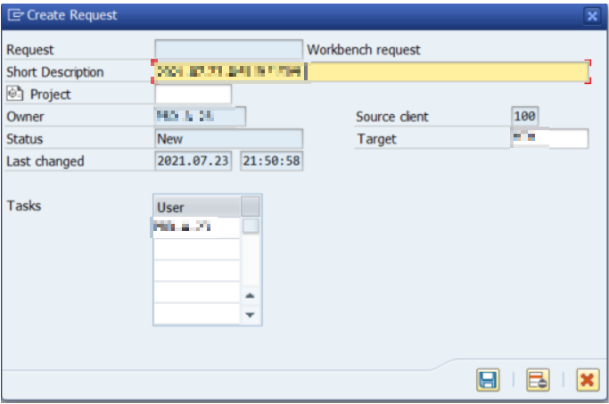
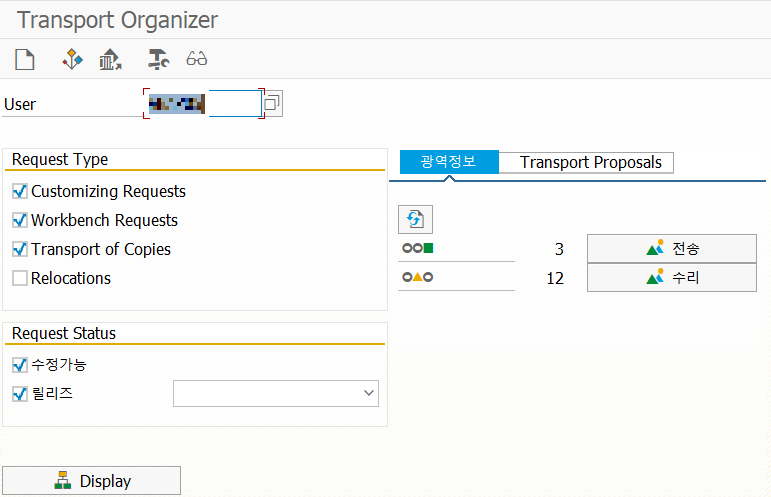
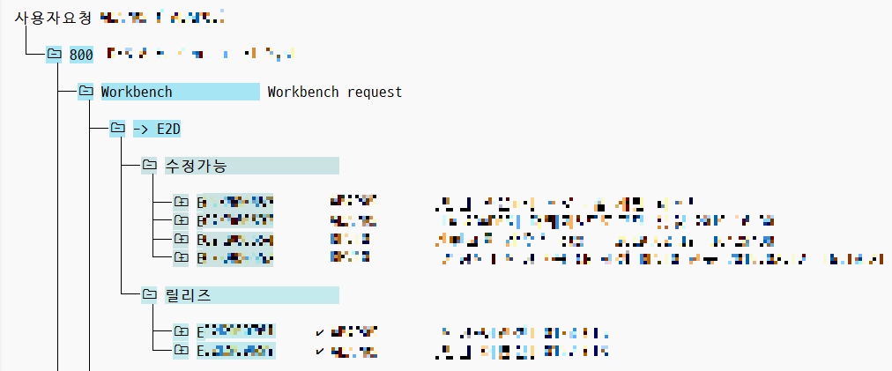
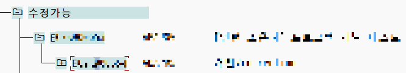
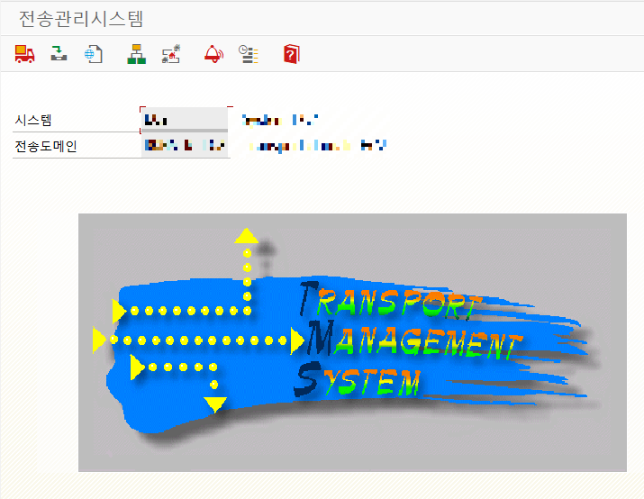
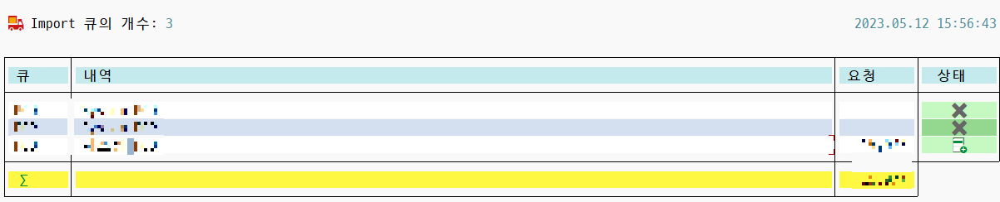
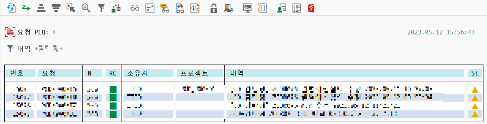
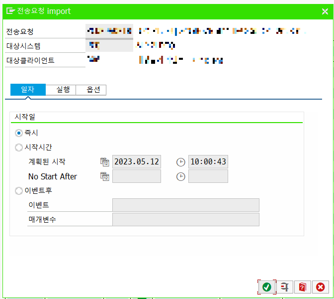
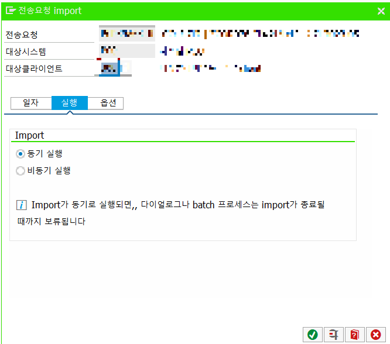
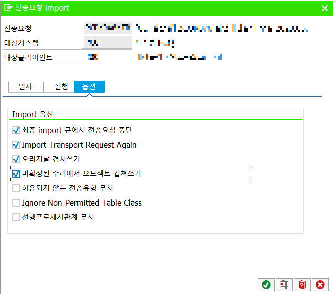

# 37. CTS TRANSPORT

개발 → 테스트 (QA) → 운영 순으로 프로그램을 이관시켜서 프로그램이 꼬이는것을 방지한다.

개발시에 CTS를 만들고 (네이밍룰 지키는것 중요) 그 개발 된 프로그램을 QA에 반영하여 테스트 해 본다.

QA에 반영하였을때 원활히 잘 작동한다면, 운영으로 넘기는데, 이때 만들었던 CTS들을 하나로 통합 하여 QA로 넘긴 후 
이 통합한 CTS를 한번에 운영에 반영하는것이 좋다. (여러 프로그램 꼬일수 있으므로)

## 1. CTS 생성

## 2. CTS 릴리즈 (개발서버에서 SE09)

아래에있는 CTS를 클릭한 후 직접릴리즈 클릭하면 체크표시가 뜨면서 릴리즈 된다.

그 후 상위폴더도 릴리즈 하면  QA서버에서 받을 준비가 됨.

## 3. CTS 받기 (QA서버에서 STMS)

IMPORT개요를 클릭

해당 큐에 들어감

해당 CTS를 클릭 후 IMPORT를 요청하면 해당 서버에 IMPORT 된다.

