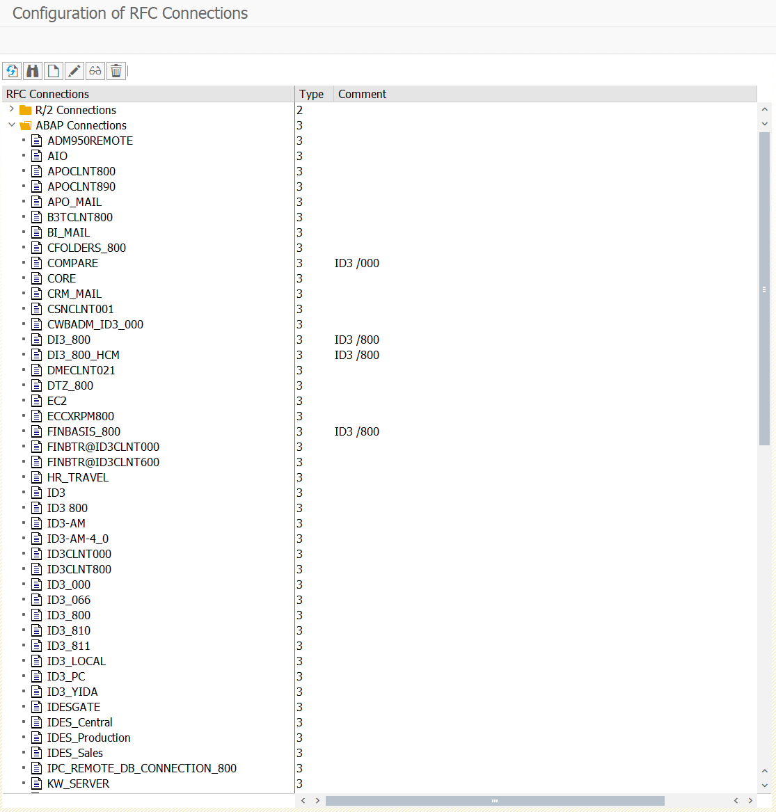
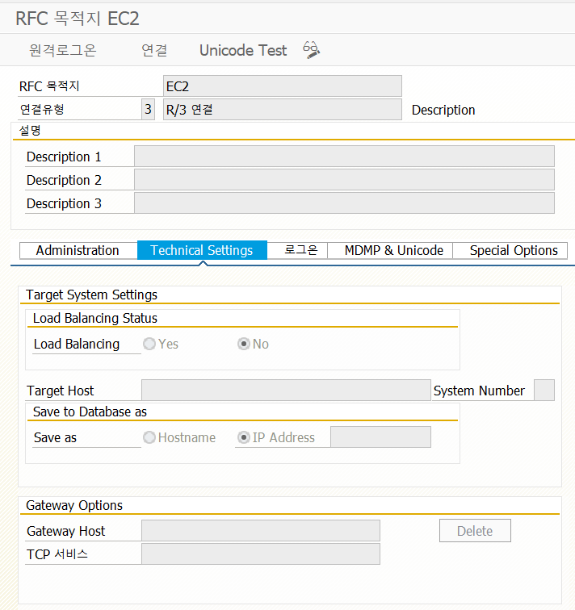

# 38. Function

우선 Function은 Subroutine처럼 모듈화하고 재사용이 가능하다.

- Subroutine과 Function의 차이
  1. Function은 Function Group이라는 Pool에 속해야 한다
  2. Function은 예외처리 기능을 제공하여 에러가 발생하면 예외 사항을 호출한 프로그램에 전달 할 수 있다.
  3. Function은 호출 프로그램에 상관없이 자체적으로 테스트를 할 수 있다.

여기서 Function Group은 Function을 모아 둔 곳으로, 별도로 수행하지는 않는다.

Function Module은 Function Group에 속해 있으며, Function Group은 ASPLZ로 시작하는 모듈풀 프로그램을 INCLUDE로 포합하여 사용한다.

### Function 종류

Regular Function Module : 일반적으로 SAP 내부에서 사용 가능하도록 제공하는 Function (예 : date 함수)

Remote-Enabled Module : RFC Function

Update Module : 일괄적으로 DB변경 및 추가적인 Function을 포함하는 기능(SAP Bundling 기술중 하나)
- Immediate start : database갱신용으로 사용시 설정, 높은 우선순위를 갖게 되며 오류 시 재시작 수행
- Immediate start(not update): 높은 우선순위로 설정, 단 업데이트 불가.

## Function 생성 (SE37)

Function Group을 생성 후 Function을 생성. Function Group이 Program이고 Function Module이 Program 내부에 있는 Sub-Rouine이라고 생각하면 된다.

다만 차이가 있다면 프로그램을 작성할 때 하나의 프로그램에 모든 내용을 처리하도록 하였지만, Function은 개별적으로 하나의 프로그램들을 구성하고 있다.

따라서 Function Group은 이들 개별적인 프로그램들을 모두 Include 명령문으로 기술하고 있어야 한다. 

실제적으로 하나의 Function Module을 만들고 그 Function Module을 포함하고 있는 Function Group의 본문을 확인 해 보면 Include가 하나 더 추가되는 것을 확인 할 수 있다.

Function을 작성하고자 할 때에는 작성하는 내용을 위하여 필요한 변수들이 어떤 것들이 있는지를 확인해야 하며, 필요한 변수들은 Import/Export Parameter들로 정의를 해 주어야 한다.

만약 필요한 내용들 중에 Internal Table의 형태가 있다면, Tables라는 정의 부분에 정의를 해 주어야 한다. 물론 필요한 변수들이 없다면 Import/Export Parameter들로 정의를 할 필요는 없다.

# RFC Function (Remote Function Call)

이기종 시스템과 Interface 데이터를 송수신하거나, 타 시스템에 현재 수행중인 프로그램으로 데이터를 송수신 할 수 있는 기능을 갖고있는 Function이다.

이와같이 접속 가능한 RFC Connection을 확인하고 destination에 기입하면 된다. RFC Transaction이 너무 많을 시에는 RFC접속 또는 수행 오류가 발생하기도 한다.

RFC는 SAP에서 제공하는 Real Time 송수신 기능이 아니다. Transaction이 일정시간대 너무 많이 몰리는 현상을 대비하기 위해 BC가 RFC Destination을 여러개 생성하여 work process를 wait하게 만들어 메모리 부여 시 작업을 수행하게도 한다.

위에있는 Connection test를 클릭하여 정상수행되면 RFC 연동이 가능한 상태인것을 알 수 있다.

RFC를 실무로 구현 시 RFC내에서 필요한 Validation check는 필수가 된다. 유효하지 않은 값이 function으로 들어오지 않게 처리를 필수적으로 해주어야 한다.
