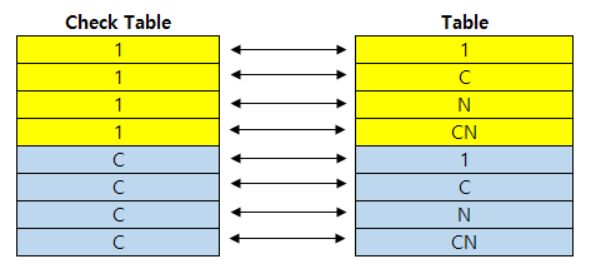

# 39. Check Table

Table 생성 시 Foreign Key로 지정한 필드는 Check Table을 가질 수 있다.
단, Foreign Key로 지정된 필드와 동일한 Data element를 Key Field로 사용하는 테이블만 Check Table로 사용 할 수 있다.

Check Table이 지정되면 입력받은 값이 Check Table에 있는 값이 아니면 입력을 못하게 하거나, 
Possible Entry로 Check Table 데이터를 보여주고 사용자가 입력 가능한 값의 범위를 제시 할 수 있다.

하지만 우리가 코딩으로 INSERT, MODIFY등의 구문으로 직접 데이타를 저장하면 모두 무시되고 테이블에 값이 들어간다.

값을 제한하고, Possible Entry로 제시하고 하는 경우는 모두 입력화면을 연결한 경우라 생각하자.

CARRID라는 필드에 커서를 두고 Foreign Key 버튼을 누르면 Check Table을 입력하는 화면이 나타난다.

해당 필드가 사용하는 Domain에 Value Table이 지정되어 있는 경우는 기본적으로 Value Table을 Check Table로 제시해 준다. 다른 테이블을 원하면 사용자가 변경하여도 된다.
Value Table이 없는 경우는 입력없이 빈 화면이 뜰 것이다.

Check Table과 필드 매핑은 Check Table의 Key Field중 우리 테이블에 같은 필드가 있으면(같은 Data Element를 사용한 필드) 기본 매핑을 제시해 준다.
그렇지 않은 Key 필드는 Generic체크된 상태로 필드를 보여준다.

강제로 SCARR Table을 SFLIGHT라는 테이블로 변경하여 보면 FLDATE필드는 매핑이 없이 나타나게 된다.

한 가지씩 항목들을 살펴보면 다음과 같다.

### Foreign Key Fields
- Generic : Check Table Key Field와 연결될 필드를 찾을 수 없을 때 체크된다.

- Constant : Check Table Key Field 매핑은 되지 않지만 Check Table Key Field값을 특정값으로 제한하고싶을 때 입력한다. 마치 Join시 상수값을 넣는것과 같다.

### Screen Check 
- Check Required : 체크되면 Check Table에 있는 값으로 입력 가능값이 제한된다.

- Error Message : Check Required 체크된 경우 값이 범위를 벗어나면 보내줄 메시지를 세팅 할 수 있다.

### Semantic Attributes

Check Table과의 연결관계를 설정한다. 정확해야 하는 필수 사항은 아니다.

### Foreign Key Field type
- Not Specified : 상관없음. 설정하지 않는다. Cardinality 필요 없음.

- Non-Key-Fields/Candidates : Foreign Key 필드가 Key Field가 아니고 값이 Unique 하지 않을 경우, Cardinality 필요.

- Key Fields of Text Table : 우리 테이블이 Check Table의 Text 테이블이면서 Key로 언어 키를 가진 경우, Cardinality 필요.
  텍스트 테이블은 하나만 가질 수 있으며 Screen 등에서 Possible Entry 생성 시 자동으로 보인다.

- Cardinality : Foreign Key와 Check Table과의 데이터 연결관계를 설명한다. Logging을 위한 목적일 뿐, 틀렸다고 문제가 되는것은 아니다.

1 : 반드시 하나의 값이 있다. Unique.
C : 값이 있을 수도 없을 수도 있다. (Option)
N : 하나 이상의 값이 반드시 있다.
CN : 하나 이상의 값이 있을수도 없을수도 있다. (Option)

Check Table 관점에서

1 : Check Table의 각 레코드에 대해 정확히 하나의 종속 레코드가 있다.
C : Check Table의 각 레코드에 대해 최대 하나의 종속 레코드가 있다.
N : Check Table의 각 레코드에 대해 하나 이상의 종속 레코드가 있다.
CN : Check Table의 각 레코드에 대해 여러 종속 레코드가 있다.

Cardinality는 ERD를 이용한 테이블의 데이터 연관도를 나타 낼 때 필요로 한다.

보통 CBO Table을 만들 때 우리는 가볍게 무시하고 넘어가게 된다. 실제로 넣지 않아도 사용상의 아무 문제가 없는것이다.

SE11에서 Graphic이라는 아이콘을 누르면 SAP ERD가 나타난다.

테이블 단위의 데이터 연결성을 가지고 프로그램을 설계하려면 Cardinality, Optionality같은 데이터 연결을 무시하면 안된다.

# Foreign Key
다른 테이블과의 관계를 나타낸다.

- 관계형 데이터베이스에서 테이블 간의 연결을 정의한다.
- Foreign Key로 연결된 필드는 같은 Data Type과 길이를 가져야 한다.
- 같은 Domain을 사용한 필드도 가능하다.
- SE11에서 필드를 지정하고 외래키 버튼을 눌러 지정한다.

