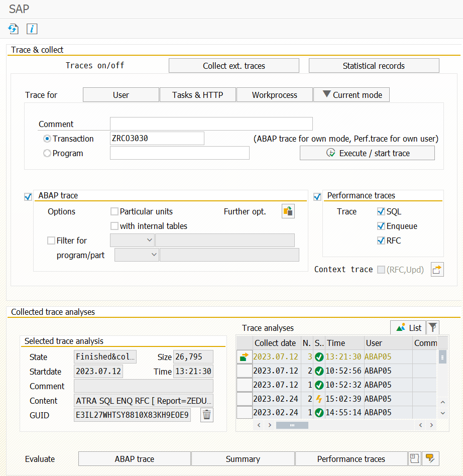
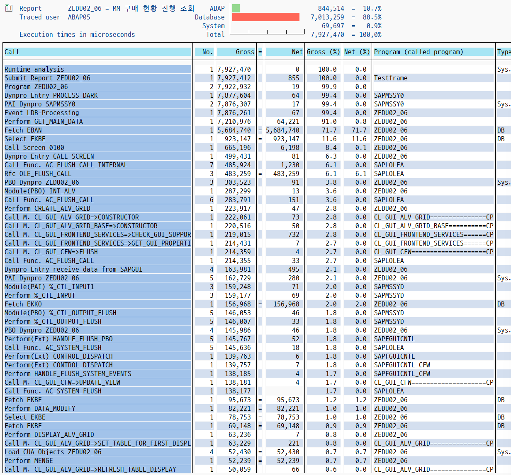

# 40. ABAP Tuning

ST12트랜잭션으로 해당 프로그램 로직에서 어느 부분이 시간을 많이 잡아먹는 지 확인 할 수 있다.

이것으로 튜닝을 진행하면 된다.

Current mode -> 해당 프로그램 Transaction 또는 Program 입력.

하고 Trace analyses 에서 체크 후 abap trace를 클릭하면 

이와같이 abap, database, system 비율을 확인 할 수 있고, 아래 세부 속도 비율을 확인 할 수 있다.

(여기서 보통 ABAP, DATABASE 비중에 20 : 80 정도 되는것이 좋다고 한다.)

더블클릭하면 해당 라인으로 이동.

## 튜닝 기록

### MODIFY

LOOP 안에서 MODIFY가 여러개 돌고 있으면 느린 경우가 많다. 같은 TABLE에 MODIFY를 여러번 한다면 하나로 합치는것이 좋고, 
TRANSPORTING, WHERE로 조건을 걸면 좋다.

### FOR ALL ENTRIES IN

HANA의 경우에는 FOR ALL ENTRIES IN보다 SELECT JOIN하거나 RANGES를 사용하는것이 좋다고 한다.(그게 더 빠르다)

ECC의 경우에는 RANGES를 사용하는것이 빠른데, RANGES는 1000줄이 넘지 않길 권장하고, 매우 많은 라인을 담은 후 DELETE나 SELECT 등의 조건에 사용하게되면덤프가 발생한다. 그래서 되도록이면 SELECT JOIN을 사용하고, 그래도 안 될 경우에는 FOR ALL ENTRIES IN을 사용한다.

