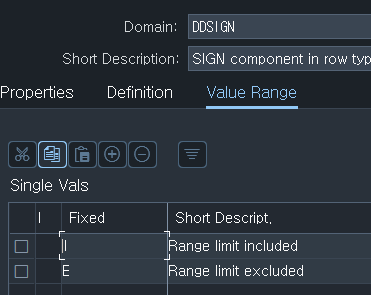
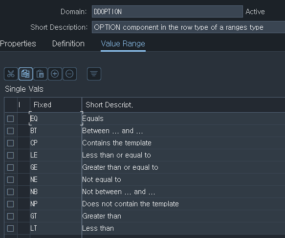

# 5. 꺼내서 볼 select 에서 where 이용, range

RANGES 구조

| 필드명 | TYPE | 타입 도메인 | 
| --- | --- | --- |
| SIGN | TYPE | DDSIGN |
| OPTION | TYPE | DDOPTION |
| LOW | TYPE | - |
| HIGH | TYPE | - |

RANGES (붙여넣을 FIELD) FOR (대상 FIELD)

RANGES변수를 선언하면 자동으로 4개의 필드를 가진 internal table이 된다고 한다.

SIGN TYPE DDSIGN(I:범위 제한 포함, E:범위 제한 제외),

OPTION TYPE DDOPTION(EQ, BT, CP, LE, GE, NE, NB, NP, GT, LT),

LOW TYPE 참조한 대상 변수와 같은 유형,

HIGH TYPE 참조한 대상 변수와 같은 유형.




EX) RANGES의 필드 값들을 매크로를 이용하여 집어 넣을 수도 있다.

## 예시

```abap
SELECT *
  INTO TABLE GT_ZTSUWON02_HR_04
  FROM ZTSUWON02_HR
  WHERE ZGENDER EQ '남'.
*  WHERE ZGENDER <> '남'.
*  WHERE ZGENDER NE '남'.

SELECT *
  INTO TABLE GT_ZTSUWON02_HR_04
  FROM ZTSUWON02_HR
  WHERE ZNAME LIKE '탄동%'.

SELECT *
  INTO TABLE GT_ZTSUWON02_HR_04
  FROM ZTSUWON02_HR
  WHERE ZHOBBY IN ( '독서', '운동' ) AND ZGENDER IN ( '남', '여' ).
  
SELECT *
  INTO TABLE GT_ZTSUWON02_HR_04
  FROM ZTSUWON02_HR
  WHERE ( ZHOBBY = '독서' OR ZHOBBY = '운동' ).
  
*CL_DEMO_OUTPUT=>DISPLAY( GT_ZTSUWON02_HR_04 ).
```

```abap
RANGES : GT_ZCODE FOR ZTSUWON02_HR-ZCODE.

GR_ZCODE-SIGN = 'I'.
GR_ZCODE-OPTION = 'EQ'.
GR_ZCODE-LOW = '001'
APPEND GR_ZCODE TO GR_ZCODE.

GR_ZCODE-SIGN = 'I'.
GR_ZCODE-OPTION = 'EQ'.
GR_ZCODE-LOW = '002'
APPEND GR_ZCODE.

SELECT *
  INTO TABLE GT_ZTSUWON02_HR_04
  FROM ZTSUWON02_HR
  WHERE ZCODE IN GR_ZCODE.
  
GR_ZCODE-SIGN = 'I'.
GR_ZCODE-OPTION = 'BT'.
GR_ZCODE-LOW = '20'.
GR_ZCODE-HIGH = '30'.
APPEND GR_ZCODE.

SELECT *
  INTO TABLE GT_ZTSUWON02_HR_04
  FROM ZTSUWON02_HR
  WHERE ZCODE IN GR_ZCODE.
```
