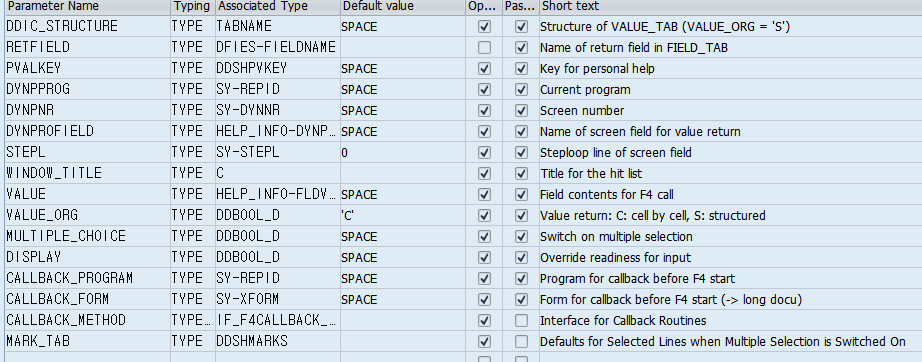
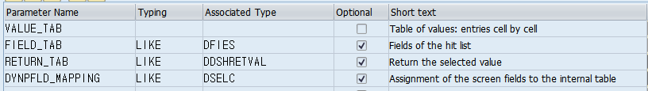
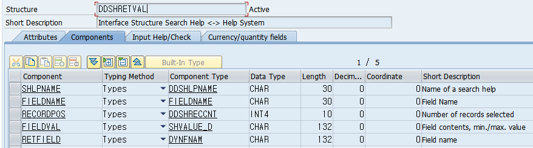

# 8. SELECT-OPTIONS

## 찾아 볼 SELECT-OPTIONS 문법

### 1. DEFAULT
미리 값을 넣어 둔다.
```abap
SELECT-OPTIONS S_TEST FOR TEST DEFAULT 'TEST'.
```

### 2. MEMORY ID
SPA/GPA에 저장한다고 하는데, 공부가 더 필요하다.
```abap
SELECT-OPTIONS S_TEST FOR TEST MEMORY ID.
```

### 3. LOWER CASE
입력받은 문자를 소문자로 변환해서 사용한다.

```abap
SELECT-OPTIONS S_TEST FOR TEST LOWER CASE.
```

### 4. OBLIGATORY
필수값으로 지정.

```abap
SELECT-OPTIONS S_TEST FOR TEST OBLIGATORY.
```

### 5. NO-EXTENSION
추가화면 (오른쪽에 추가조건 입력 할 수 있는 버튼)을 사용 할 수 없게 한다.

```abap
SELECT-OPTIONS S_TEST FOR TEST NO-EXTENSION.
```
### 6. NO-INTERVALS
HIGH값을 입력할 수 없다. 추가화면은 사용 할 수 있다.

```abap
SELECT-OPTIONS S_TEST FOR TEST NO-INTERVALS.
```
## SELECT OPTIONS에 SEARCH HELP 달기

```abap
AT SELECTION-SCREEN ON VALUE-REQUEST FOR S_ZEMPNO-LOW.
  PERFORM F4_ZEMPNO.
```
SELECT-OPTIONS의 LOW부분 창에 SEARCH HELP를 지정하는 코드.

```abap
FORM f4_zempno USING PARA.
  DATA : BEGIN OF LS_ZEMPNO,
          ZEMPNO TYPE ZDSUWONT02-ZEMPNO,
          ZEMPNM TYPE ZDSUWONT02-ZEMPNM,
         END OF LS_ZEMPNO,
         LT_ZEMPNO LIKE TABLE OF LS_ZEMPNO.
  DATA : LT_RETURN TYPE TABLE OF DDSHRETVAL,
         LS_RETURN TYPE DDSHRETVAL.
         
  SELECT ZEMPNO ZEMPNM
    INTO CORRESPONDING FIELDS OF TABLE LT_ZEMPNO
    FROM ZDSUWONT02.
    
    "서치헬프 FUNCTION
    CALL FUNCTION 'F4IF_INT_TABLE_VALUE_REQUEST'
      EXPORTING
*       DDIC_STRUCTURE         = ' '
        retfield               = 'ZEMPNO'
*       PVALKEY                = ' '
*       DYNPPROG               = ' '
*       DYNPNR                 = ' '
*       DYNPROFIELD            = ' '
*       STEPL                  = 0
*       WINDOW_TITLE           =
*       VALUE                  = ' '
       VALUE_ORG              = 'S'
*       MULTIPLE_CHOICE        = ' '
*       DISPLAY                = ' '
*       CALLBACK_PROGRAM       = ' '
*       CALLBACK_FORM          = ' '
*       CALLBACK_METHOD        =
*       MARK_TAB               =
*     IMPORTING
*       USER_RESET             =
      tables
        value_tab              = LT_ZEMPNO
*       FIELD_TAB              =
       RETURN_TAB             = LT_RETURN "선택하면 값이 필드에 들어감
*       DYNPFLD_MAPPING        =
     EXCEPTIONS
       PARAMETER_ERROR        = 1
       NO_VALUES_FOUND        = 2
       OTHERS                 = 3
              .
    IF sy-subrc <> 0.
* Implement suitable error handling here
    ENDIF.

ENDFORM.
```





DDSHRETVAL는 서치헬프로 띄우는 전형적인 형식의 테이블 인것같다.

그래서 리턴 받는 테이블(LT_RETURN)은 이 테이블(DDSHRETVAL)을 참고하는 것 같다.

## SELECT-OPTIONS 상위 TITLE (1000 SCREEN) 바꾸기

### 1. PROGRAM CODE 로 TITLE 제어

```abap
INITIALIZATION
  SY-TITLE = 'TITLE TEST'
```

### 2. 속성 이용

ABAP 편집기의 툴바 [이동->속성] 에서 설정.
