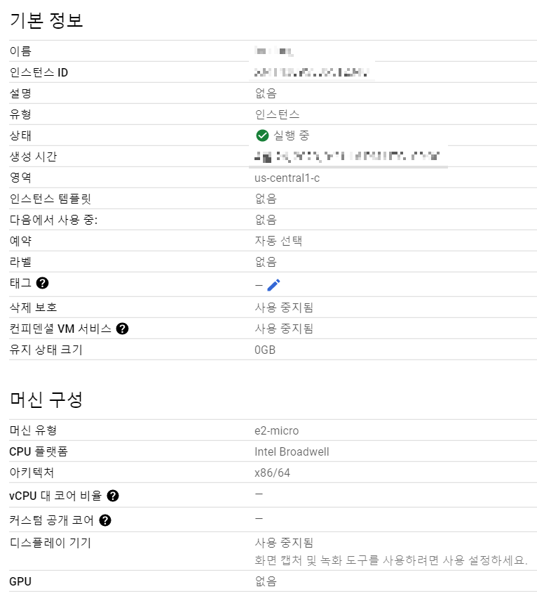

# 1. GCP(Google Cloud Plattform), Python 환경설정

## VM 인스턴스 설정

Comput Engine VM instance Setting




## SSH(Secure SHell) Ubuntu에서 Python 설정

SSH란 원격지 호스트 컴퓨터에 접속하기 위해 사용되는 보안 쉘이다.

GCP에서 SSH를 클릭해주면 내가 만든 컴퓨터에 접속 할 수 있다.

접속한 후 python을 설치해주어야 한다. ubuntu를 실행하면 기본적으로 설치되어있기때문에 버전을 확인해 준다.

```sh
$ python3 -V
Python 3.10.7
```

pip를 install 해 준다.

```sh
$ wget https://bootstrap.pypa.io/get-pip.py
$ sudo python3 get-pip.py
$ pip -V
pip 23.1.2 from /usr/local/lib/python3.10/dist-packages/pip (python 3.10)
```

python 파일을 넣어 줄 폴더를 생성한다.

```sh
$ mkdir coin
$ ls
coin
$ cd coin
~/coin$ ls
nohup.out  upbit_cointrade.py
```

그 폴더 안에 .py 파일을 만들고 들어간다.

```sh
~/coin$ vi test.py
```

들어가서 코드 입력 후 저장 나가기

```sh
:wq , :q (:q는 저장하지 않고 나가기)
```

저장한 python 파일 실행

```sh
~/coin$ python3 test.py
```
