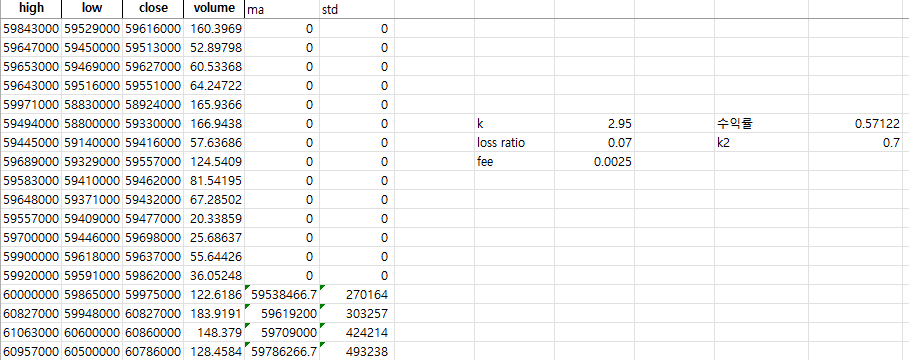
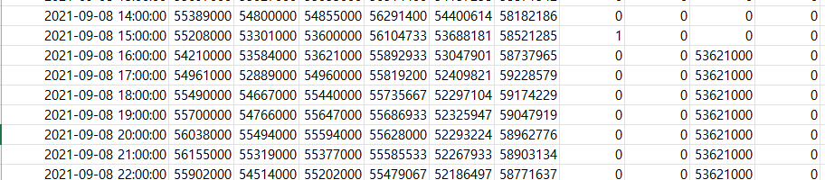

# 비트코인 자동화 프로그램 프로젝트

## 🗃️ Table of Contents

---

## 💡 Objective

---

주식 시장에 비해 비트코인 시장은 24시간 활성화 되어 있고, 수시로 호가가 급변하는 성격을 가지고 있어, 보고서 에서는 특정 매매 기준을 가지고 자동화 한다면 일정한 수익률을 얻을 수 있을 것이라 기대하여 프로젝트를 수행하였다.

- **실시간 구독형 프로그램 개발**
    
    비트코인 시장은 초 단위로 호가가 급변하므로 자동 매매 시에는 변화하는 시점에 맞추기 위해 실시간 구독 형식으로 진행 되어야 한다.
    
- **백 테스팅으로 수익 구현 모델 수립**
    
    수익 구현 모델을 수식화 하여 바로 시장에 투입하게 되면 많은 손실이 발생 할 수 있다. 그러므로 반드시 백 테스팅으로 수익을 예상 한 후 수정하여 진행 하도록 한다.
    

## 🔃 Project Process

---

### 📈 수익 모델 수식화

많은 투자자들이 생각하는 ‘많이 떨어졌으니 사야겠다’, ‘많이 올랐으니 팔아야 겠다’는 지점을 찾는 것이 중요하다고 판단하여 그 기준을 ‘표준편차’로 두기로 했다. 이 편차 범위 외에 있으면 이례적인 값을 가졌다고 보고 매매를 실현 하도록 했다.

이는 ‘기술적 그래프 분석’ 에 대한 책과 인터넷 자료들을 참고하여 수식화 하였다.

<aside>
💡 매매 범위 수식 = (이동 평균값) (+/-) k*(표준편차)

</aside>

### 🧪수익 모델을 이용해 백 테스팅

업비트에서 과거 2년 정도의 OHCL(시고종저가) 데이터 등을 엑셀로 불러와 저장 한 후 이를 이용하여 백테스팅 한다. 예상 수익률과 최대 손해율을 계산하여 적절한 상수값을 구하는 것을 목표로 한다.

- **백테스팅 결과 예시**
    
    백테스팅 프로그램을 만든 후 상수값만 계속 바꿔주어 높은 수익률이 발생하는 지점을 구했다. 이 때 수수료를 꼭 고려해야 한다.
    
    
- **Several Issues**
    - **Issue 1**
        
        엑셀을 최대한 이용하여 백테스팅을 하려다 보니, 구매 후 보유 중 임을 확인 하고 계산하기가 어려웠다. 그래서 엑셀은 최대한 기본적인 데이터를 저장하는 용도로만 사용하고, 파이썬을 이용해 실제 실행할 프로그램과 유사하게 구성하여 수익 확인에 필요한 값만을 엑셀에 표시하는 방식으로 진행했다.
        
        
        
    - **Issue 2**
        
        처음에 업비트 매도, 매수 수수료를 고려 하지 않고 백테스팅을 하였더니 수익률이 비 정상적으로 높게 나왔다. 다시 수수료를 빼고 계산하였더니 정상 범위에 들어왔다.
        

### 🤖 수식을 적용 시켜 프로그램 제작

백 테스팅을 충분히 실행 한 후 결정된 상수 값들을 이용하여 프로그램을 제작한다.

업비트에서 제공하는 실시간 구독 서비스를 이용하여 빠르게 변하는 호가들을 놓치지 않고 계산에 이용하는 것이 가장 중요하다.

- **Several Issues**
    - **Issue 1**
        
        가끔 빗썸이나 업비트에서 값을 읽어 올 때 에러가 뜨는 경우가 있었다. 이는 서버 에러로, 무시하고 다시 프로그램을 진행시키면 되기 때문에 try ~ except 구문을 이용해 에러를 무시 했다.
        
    - **Issue 2**
        
        매도 후 딜레이를 주지 않고 실행하였더니, 매도 후 바로 매수 신호를 보내 손해가 발생했다. 그래서 1시간 봉에서는 1시간의 딜레이를 두고 매수 하도록 하였다.
        

## 👩‍💻 Development Features

---

## 🧑‍💻 Code Review

### Main program

이 프로젝트는 15일 간의 표준편차를 15일 이동 평균값을 중심으로 범위를 구하고 구매 지점과 판매 지점을 정하여 수행하는 프로그램이다.

```python
from urllib import request
import websockets
import asyncio
import json
import sys
from xcoin_api_client import *
import numpy
```

```python
access = "키값 (비밀입니다)";
secret = "시크릿 값 (비밀입니다)";
upbit = pyupbit.Upbit(access, secret)

def app_program(url):
    headers = {"Accept": "application/json"}
    response = requests.get(url, headers=headers)
    response = response.text
    response = ast.literal_eval(response)
    return response
```

업비트에서 실시간 데이터를 구독하는 websocket 모듈과 업비트에서 제공하는 클라이언트를 불러온 후 제 계정의 자산 데이터를 불러온다.

```python
async def upbit_ws_client():
    uri = "wss://api.upbit.com/websocket/v1"

    async with websockets.connect(uri, ping_interval=None) as websocket:
        print("start")

        subscribe_fmt = [
            {"ticket":"test930426"},
            {
                "type":"ticker",
                "codes":["KRW-BTC"],
                "isOnlyRealtime":True
            },
            {"format":"SIMPLE"}
        ]
        sumscribe_data = json.dumps(subscribe_fmt)
        await websocket.send(sumscribe_data)
```

함수가 실행 되는 중에도 값을 받기 위해 비동기 함수인 async def내에 웹소켓을 사용하여 누군가 코인 매매를 실현 할 때 실시간으로 데이터를 받을 수 있도록 구독한다.

<!-- 
```python
k = 2.95
k2 = 0.7
loss_ratio = 0.06
fee = 0.0025

buy_price = 0
sell_point = 0
buy_range = 0
buy_point = 0
transaction_point = 0
transaction_point_2 = 0
``` -->

본격적으로 수식을 사용하기 위해 상수값을 설정 한다. (이 부분은 비밀)

<aside>
💡 매매 범위 수식 = (이동 평균값) (+/-) k*(표준편차)

</aside>

이에 따라 while문을 사용하여 프로그램을 계속 실행 한다. 구독 리턴 시 코인의 1시간 봉 데이터 (close, open, high, low - 종가, 시가, 고가, 저가)를 실시간으로 받는다. 받은 OHCL값을 이용하여 15 이동 평균선, 이 평균선에 따른 표준편차를 구하여 매매 범위(이하 밴드)를 구한다.

판매 시 구매 한 가격의 편차를 고려 하기 위해 sell_ratio값을 정한다.

```python
while True:
 try: 
  orderbook = app_program("https://api.upbit.com/v1/orderbook?markets=KRW-BTC")
  candlestick = app_program("https://api.upbit.com/v1/candles/minutes/60?market=KRW-BTC&count=2")
  result2 = upbit.get_order("KRW-BTC")

  close = candlestick[-1]['trade_price']
  open = candlestick[-1]['opening_price']
  high = candlestick[-1]['high_price']
  low = candlestick[-1]['low_price']

  df = pyupbit.get_ohlcv("KRW-BTC", interval="minute60")
  ma = df['close'].rolling(15).mean()[-2]
  stdev =df['low'].rolling(15).std()[-2]

  BBp = ma + k*stdev
  BBm = ma - k*stdev

  bid = orderbook[0]['orderbook_units'][0]['bid_price']
  ask = orderbook[0]['orderbook_units'][0]['ask_price']

  sell_ratio = 0
```

계좌의 잔액(원화, 비트코인)을 가져온다.

```python
#asset
my_asset = upbit.get_balance("KRW")
my_BTC_asset = upbit.get_balance("KRW-BTC")
```

1. 구매를 하지 않은 상태에서 1시간 이전 종가가 매매 범위 아래에 있을 시 매수 신호를 1로 입력한다.
2. 매수 신호가 1이고 이전 캔들이 상승 캔들이며, 이전 종가가 평균가보다 아래에 있으면 현재 매수 호가에 구매한다.
3. 코인을 구매하여 보유 하고 있을 시, 이전 고가가 매매 범위보다 위에 있으면 매도 신호를 1로 입력한다.
4. 매도 시점을 매수 시점에 따라 조절 하기 위해 buy range를 설정한다. 

<aside>
💡 buy_range = ( 평균가 - 구매가 )*k

</aside>

```python
if transaction_point == 0 and transaction_point_2 == 0:
if buy_price == 0 and close < BBm and buy_point == 0:
    buy_point = 1
    
    print("buy point")

if buy_price == 0 and buy_point == 1 and close > open and close < ma:
    buy_price = ask
    buy_point = 0
    ticker_unit = my_asset/buy_price
    buy_range = (ma - buy_price) * k2

    print("buy. buy price :",buy_price, "buy_range :",buy_range)
    transaction_point = 1
    time.sleep(5) 

if buy_price > 0:
    if sell_point == 0:
        if high > BBp :
            sell_point = 1

            print("sell point")
```

1. 매도 신호가 1일 때, 이전 종가가 buy_range보다 높고 수수료 보다 높은 수익률을 가질 경우 매도 호가에 매도 한다.
2. 만약 하한선인 loss_ratio에 매도호가가 도달하게 되면 바로 매도 한다.

```python
elif sell_point == 1:
if (ma - buy_range) > close and close > buy_price*(1+fee):
    ticker_unit = my_BTC_asset
    sell_ratio = (bid - buy_price)/buy_price - fee
    print("sell. sell_ratio :",sell_ratio,"bid :",bid)
    transaction_point_2 = 1

if bid < buy_price * (1-loss_ratio):
ticker_unit = my_BTC_asset

sell_ratio = (bid - buy_price)/buy_price - fee
sell_ratio = -sell_ratio

print("loss. sell_ratio :",sell_ratio,"bid :",bid)  
transaction_point_2 = 1  
time.sleep(3600)             
```

종종 매수 주문이 들어가지 않거나, 체결이 되지 않은 상태에서 프로그램이 진행되는 경우가 있으므로 체결 확인 신호를 주어 체결이 되지 않으면 체결이 될 때까지 매수 또는 매도를 시도하도록 한다. 만약 간혹 일어나는 프로그램의 오류로 매매 주문이 들어 가지 않을 경우 프로그램을 다시 진행 시키도록 한다.

```python
#체결확인
      elif transaction_point == 1:
          if ( not result2 ) and my_BTC_asset < 0.00002:
              transaction_point = 0
              buy_price = 0
              buy_range = 0
              buy_point = 1
              print("매수 설정 안됨")
              time.sleep(1) 

          elif my_BTC_asset > 0.00002 :
              transaction_point = 0
              print("transaction")
              time.sleep(1) 

      elif transaction_point_2 == 1:
          if ( not result2 ) and my_BTC_asset > 0.00002:
              transaction_point_2 = 0
              print("매도 설정 안됨")
              time.sleep(1) 

          elif my_BTC_asset < 0.00002 :
              transaction_point_2 = 0
              sell_point = 0
              buy_price = 0
              print("transaction")
              time.sleep(3600)               
    except:
        time.sleep(1)

async def main():
    await upbit_ws_client()

asyncio.run(main())
```

### Back Testing program

- **데이터를 엑셀로 가져오는 프로그램**
    
    과거 60분봉 데이터를 가져온다. count=400, 400개의 데이터를 가져 올 수 있다. 시간대 별로 가져 올 수 있는 데이터 양이 한정되어 있다.
    
    ```python
    candlestick_10m_data = pyupbit.get_ohlcv("KRW-BTC",interval="minute60",count=400)
    candlestick_10m_data.to_excel("candlestick_1h_data.xlsx")
    ```
    
- **백 테스팅 프로그램**
    1. 상수 값을 설정 해 준다. 이후에 값을 변화시키며 수익률을 확인하는 값들이다.
    2. 엑셀에 저장되어있는 데이터를 다시 읽어 온다.
    3. 엑셀 sheet1의 각 필드에 계산에 필요한 값들을 넣어준다.
    4. 한 줄씩 읽어서 테스팅 하기 위해 데이터들을 get_list 함수를 이용하여 리스트 화 한다.
    
    ```python
    from tracemalloc import start
    import datetime
    from unicodedata import name
    import pybithumb
    import pandas as pd
    import numpy as np
    from xcoin_api_client import *
    from openpyxl import workbook
    from openpyxl import load_workbook
    
    read_xlsx = load_workbook(r'C:/Users/../data_analysis_3.xlsx',data_only=True)
    read_sheet = read_xlsx['Sheet1']
    
    def get_list(name_call):
        names = []
        for cell in name_call:
            names.append(cell.value)
        return names
    
    def BBm_cal(k,ma15list,stdevlist):
        names =[]
        for i in range(len(ma15list)):
            names.append(ma15list[i]-k*stdevlist[i])
        return names
    
    def BBp_cal(k,ma15list,stdevlist):
        names =[]
        for i in range(len(ma15list)):
            names.append(ma15list[i]+k*stdevlist[i])
        return names
    
    #BB 상수, 변수
    fee = 0.0025
    loss_ratio = 0.06
    k = 2.95
    K = k
    k2 = 0.7
    range_a = 1
    range_b = 6154
    time_row = read_sheet['A'][range_a:range_b]
    open_row = read_sheet['B'][range_a:range_b]
    high_row = read_sheet['C'][range_a:range_b]
    low_row = read_sheet['D'][range_a:range_b]
    close_row = read_sheet['E'][range_a:range_b]
    stdev_row = read_sheet['H'][range_a:range_b]
    stdev_row2 = read_sheet['I'][range_a:range_b]
    ma15_row = read_sheet['G'][range_a:range_b]
    
    times = get_list(time_row)
    opens = get_list(open_row)
    highs = get_list(high_row)
    lows = get_list(low_row)
    closes = get_list(close_row)
    stdevs = get_list(stdev_row)
    stdevs2 = get_list(stdev_row2)
    ma15_list = get_list(ma15_row)
    
    BBm_list = BBm_cal(K,ma15_list,stdevs)
    BBp_list = BBp_cal(K,ma15_list,stdevs2)
    
    #for문 관련
    buy_price = 0
    sell_point = 0
    buy_range = 0
    buy_point = 0
    
    buy_price_list = []
    sell_ratio_list = []
    sell_point_list = []
    buy_point_list = []
    ```
    
    리스트화 된 데이터를 한줄씩 읽어 시뮬레이션을 수행한다.
    
    ```python
    for i in range(len(closes)):
      sell_ratio = 0
      sell_ratio_2 = 0       
    
      if buy_price == 0 and closes[i] < BBm_list[i] and buy_point == 0:
          buy_point = 1
    
      if buy_price == 0 and buy_point == 1 
      and closes[i] > opens[i] and closes[i] < ma15_list[i]:
          buy_point = 0
          buy_price = closes[i]
          buy_range = (ma15_list[i] - buy_price) * k2
    
      if buy_price > 0:
          if sell_point == 0:
              if highs[i] > BBp_list[i] :
                  sell_point = 1
    
          elif sell_point == 1 :
            if (ma15_list[i]-buy_range) > buy_price*(1+fee) 
    		    and closes[i] < (ma15_list[i]-buy_range):
              sell_ratio = (ma15_list[i]-buy_range-buy_price)/buy_price - fee
              sell_point = 0
              buy_price = 0
    
          if lows[i]< buy_price*(1-loss_ratio):
            sell_ratio = -loss_ratio- fee
            sell_point = 0
            buy_price = 0
    
      buy_price_list.append(buy_price)
      sell_ratio_list.append(sell_ratio)
      sell_point_list.append(sell_point)
      buy_point_list.append(buy_point)
    
    print(sum(sell_ratio_list))
    ```
    
    엑셀에서 보기 좋게 리스트화 된 데이터들의 필드 명을 지정해 준다.
    
    ```python
    df = pd.DataFrame()
    df['time'] = times
    df['high'] = highs
    df['low'] = lows
    df['close'] = closes
    df['ma'] = ma15_list
    df['BBm'] = BBm_list
    df['BBp'] = BBp_list
    df['buy_point'] = buy_point_list
    df['sell_point'] = sell_point_list
    df['buy_price'] = buy_price_list
    df['sell_ratio'] = sell_ratio_list
    df.to_excel(r'C:/Users/data_analysis_4.xlsx', index = False)
    ```
    

## 🏁 Outcome

---

백 테스팅 결과 약 2년간 50~60%의 수익률이 예상 되었고, 20%이상 급락하는 하락장에서도 -6%정도로 방어 하는 것을 확인 할 수 있었다. 과거의 데이터를 이용해 테스팅을 진행 한 것이므로 실제 시장에 반영 할 시에는 수익률이 조금 감소할 것으로 예상되지만, 현재 약 4개월 동안 약 5%정도의 수익률 (3개월 하락장이 포함 됨) 을 내고 있어 프로그램 개발 목표를 달성 하였다고 본다.
